# **Base Concept**

## **1. Execution client: geth**

- listens to new transactions broadcasted in the network, executes them in EVM, and holds the latest state and database of all current Ethereum data.
- In summary, the execution client is:
  - a user gateway to Ethereum
  - home to the Ethereum Virtual Machine, Ethereum's state and transaction pool.

## **2. Consensus client (also known as the Beacon Node, CL client or formerly the Eth2 client): prysm**

- implements the proof-of-stake consensus algorithm, which enables the network to achieve agreement based on validated data from the execution client.
- The consensus client deals with all the logic that enables a node to stay in sync with the Ethereum network. This includes receiving blocks from peers and running a fork choice algorithm to ensure the node always follows the chain with the greatest accumulation of attestations
- The consensus client does not participate in attesting to or proposing blocks - this is done by a validator, an optional add-on to a consensus client
- A consensus client without a validator only keeps up with the head of the chain, allowing the node to stay synced

## **3. Client-diversity**

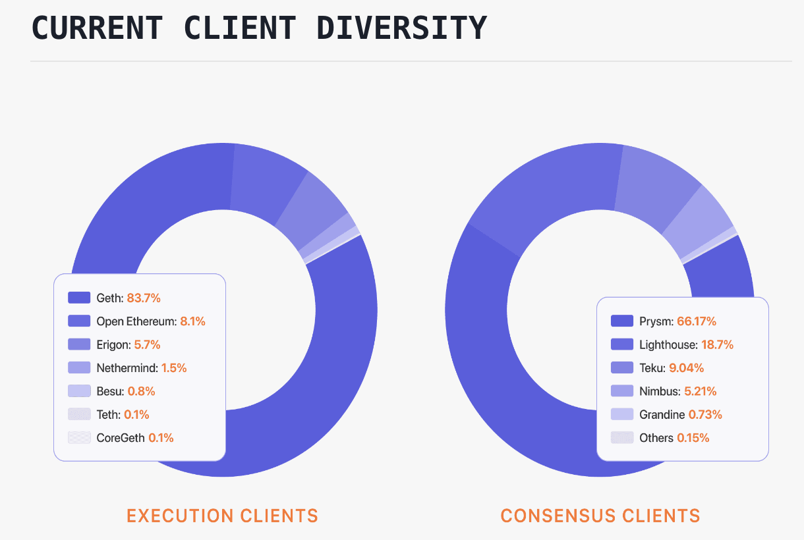

## **4. Validator**

- we add a validator to their consensus clients by depositing 32 ETH in the deposit contract.
- The validator client comes bundled with the consensus client and can be added to a node at any time
- The validator handles attestations and block proposals
- They enable a node to accrue rewards or lose ETH via penalties or slashing.
- Running the validator software also makes a node eligible to be selected to propose a new block

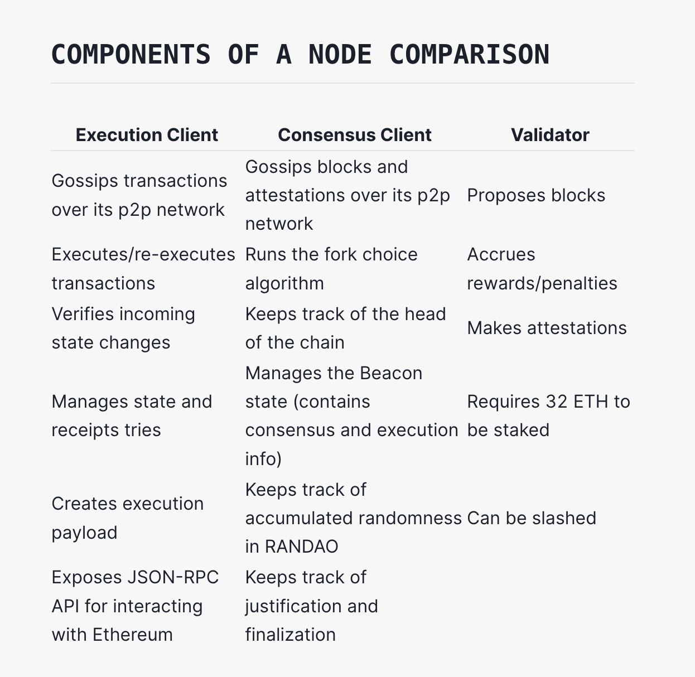
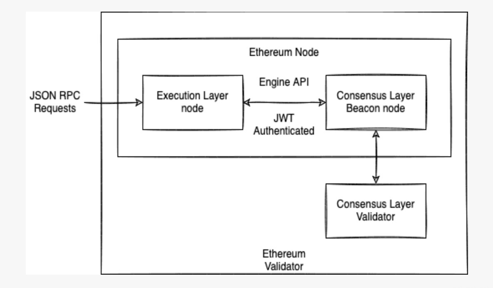
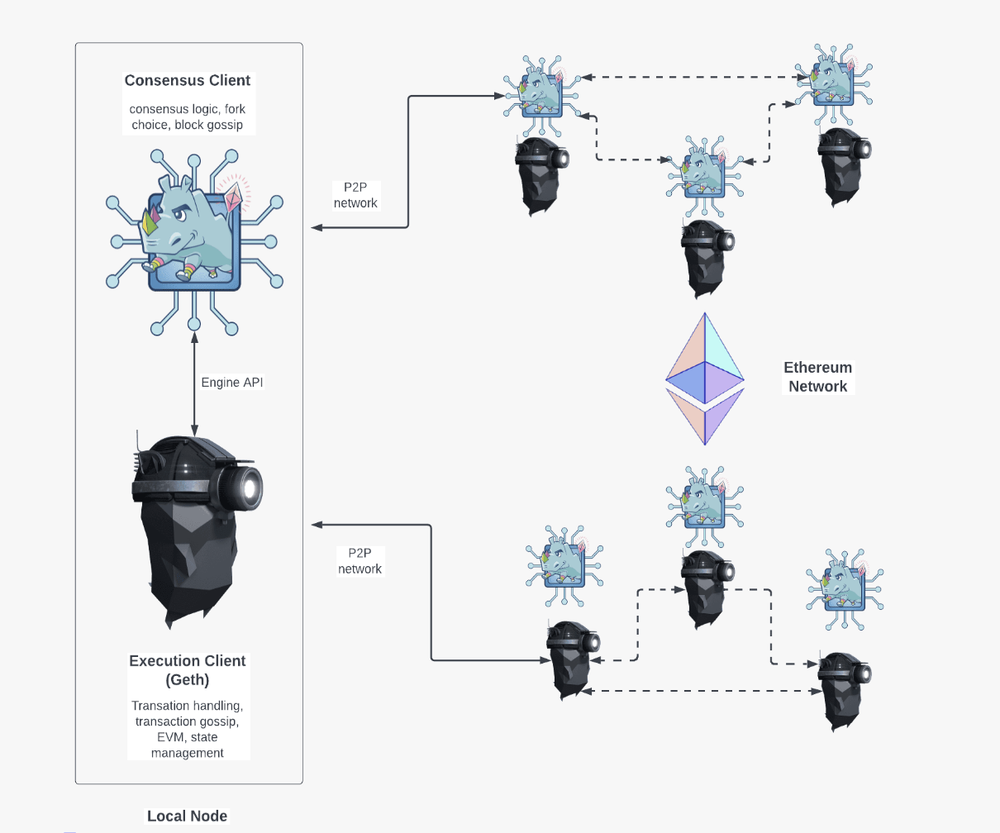
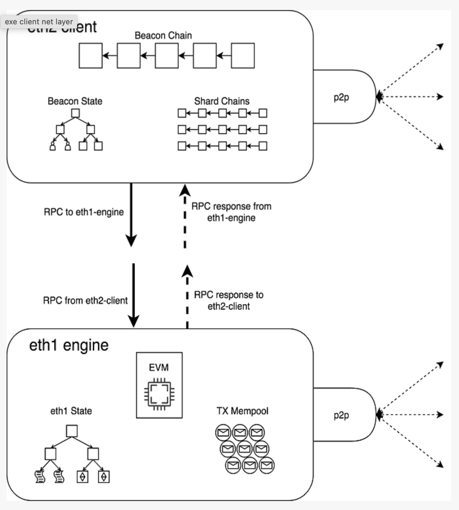

## **5. Base fee**

- Each block has a target size of 15 million gas up until the block limit of 30 million gas (2x the target block size)
  - -> if the block size is greater than the target block size, the protocol will increase the base fee for the following block
  - -> The base fee will increase by a maximum of 12.5% per block if the target block size is exceeded

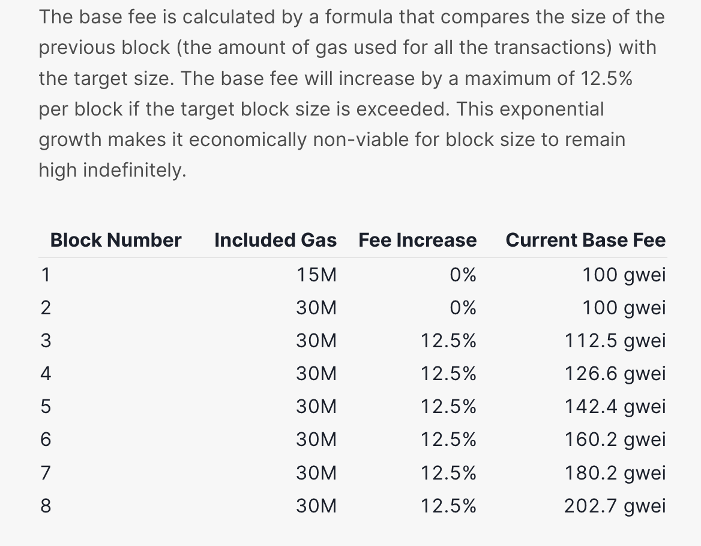

## **6. Gas limit**

- refers to the maximum amount of gas you are willing to consume on a transaction
- A standard ETH transfer requires a gas limit of 21,000 units of gas.
- For example, if you put a gas limit of 50,000 for a simple ETH transfer, the EVM would consume 21,000, and you would get back the remaining 29,000. However, if you specify too little gas, for example, a gas limit of 20,000 for a simple ETH transfer, the EVM will consume your 20,000 gas units attempting to fulfill the transaction, but it will not complete. The EVM then reverts any changes, but since the miner has already done 20k gas units worth of work, that gas is consumed.

## **7. State**

- State means a snapshot of blockchain at the given moment
- Ethereum can be referred to as transaction-based state machine. It consists of accounts and applications executing transactions which are changing their state
- The global data with information about each account and contract is stored in a trie database called state. This is handled by the execution layer (EL) client and includes:
  - Account balances and nonces
  - Contract code and storage
  - Consensus-related data, e.g. Staking Deposit Contract

## **8. Full vs Archive nodes**

- Full Node: Stores and maintains recent block data (i.e., the last 128 blocks) on disk. It serves blockchain data upon request and helps support the network by participating in block validation and by verifying all blocks and states. All states can be derived from a Full node
  => computationally demanding when the desired state is far from the nearest snapshot

- Archive Node: Inherits the same capabilities as Full nodes and also builds an archive of historical states. This type of node is useful when querying historical blockchain data that is not accessible on Full nodes. Archive nodes aren’t required to participate in block validation and can be built from scratch using a Full node.
  Use cases: - Service providers like block explorers - Researchers - Security analysts - Dapp developers - Auditing and compliance

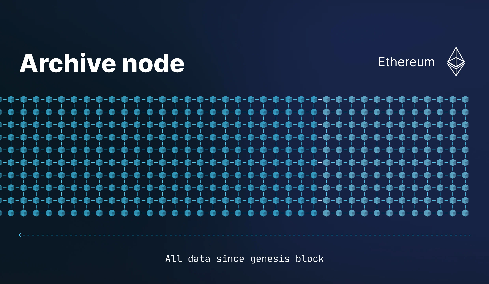
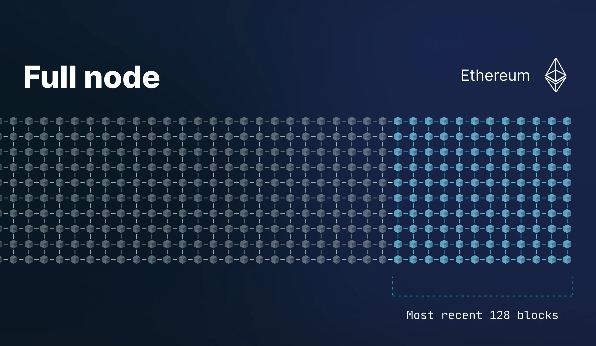
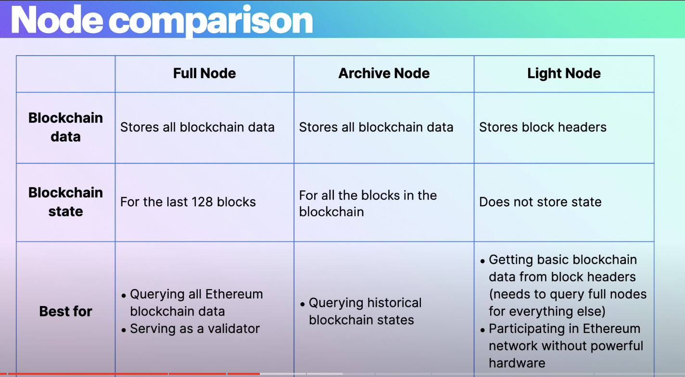

## **9. hw-requirement**

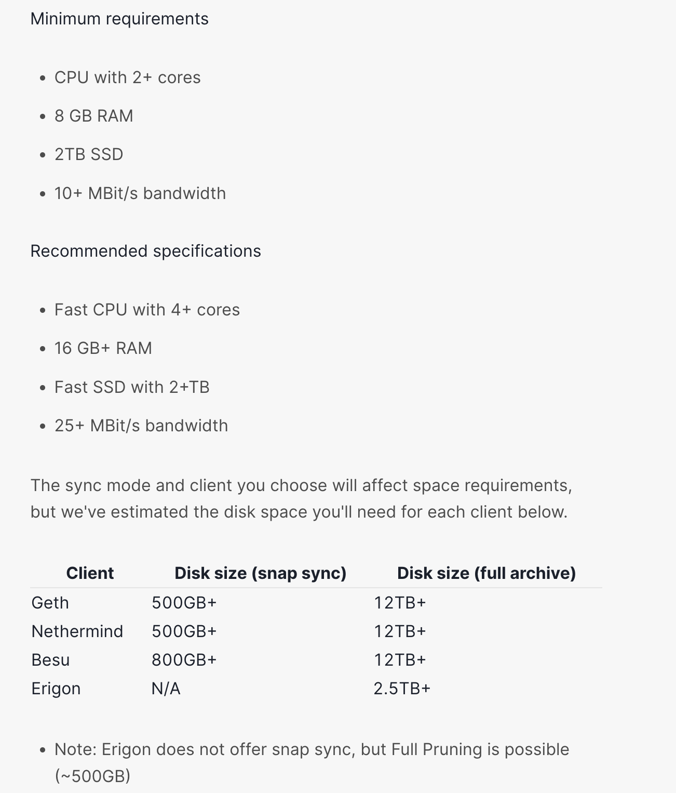
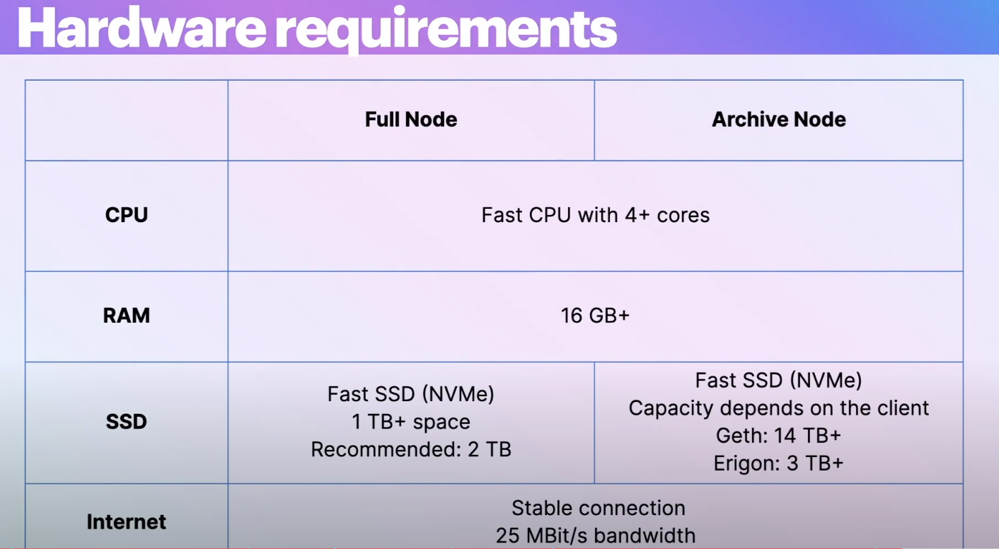

