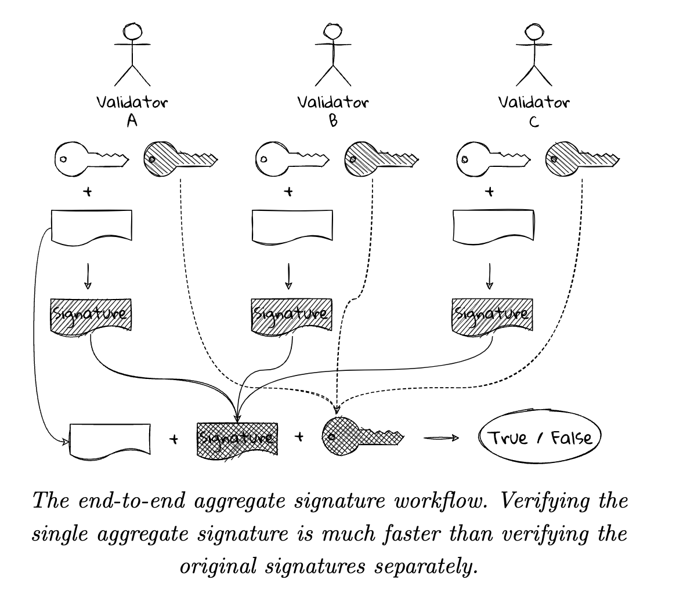
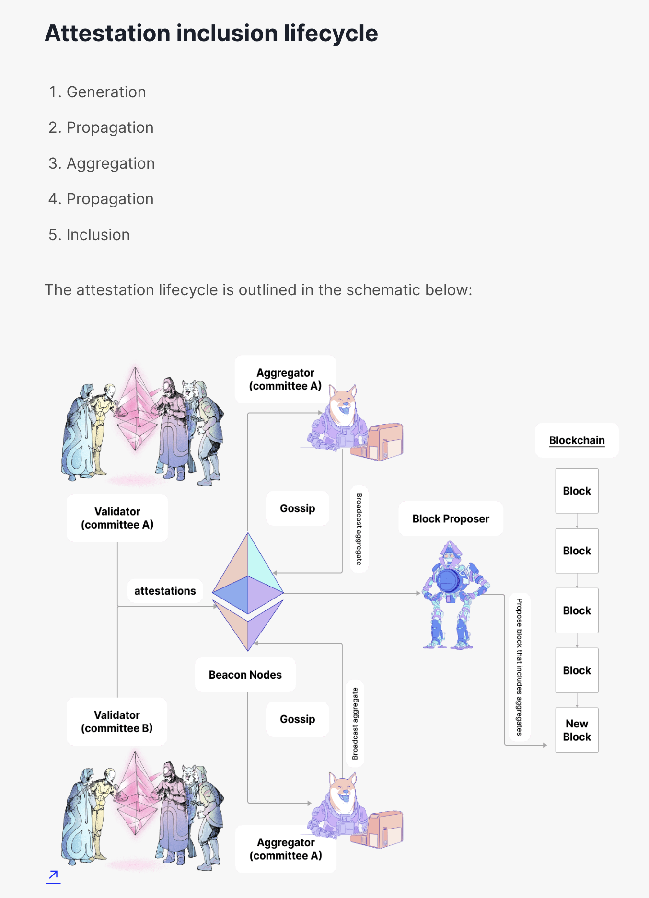

# **Proof-Of-Stake (PoS)**

---

## **1. Block creation**

- Validators create blocks.
- One validator is randomly selected in each slot to be the block proposer. Their consensus client requests a bundle of transactions as an 'execution payload' from their paired execution client. They wrap this in consensus data to form a block, which they send to other nodes on the Ethereum network => This block production is rewarded in ETH
- In rare cases when multiple possible blocks exist for a single slot, or nodes hear about blocks at different times, the fork choice algorithm picks the block that forms the chain with the greatest weight of attestations (where weight is the number of validators attesting scaled by their ETH balance).

## **2. Chain selection rule**

- A chain selection rule is used to decide which chain is the "correct" chain.
- Ethereum runs on proof-of-stake it adopted an updated fork-choice algorithm that measures the 'weight' of the chain. The weight is the accumulated sum of validator votes, weighted by validator staked-ether balances

https://arxiv.org/pdf/2003.03052.pdf

## **3. Validator**

- To participate as a validator, a user must deposit 32 ETH into the deposit contract and run three separate pieces of software: an execution client, a consensus client, and a validator.
- One validator is randomly selected to be a block proposer in every slot. This validator is responsible for creating a new block and sending it out to other nodes on the network.
- Also in every slot, a committee of validators is randomly chosen, whose votes are used to determine the validity of the block being proposed.

## **4. Block time**

- Whereas under proof-of-work, the timing of blocks is determined by the mining difficulty
- In proof-of-stake, the tempo is fixed.
- Time in proof-of-stake Ethereum is divided into slots (12 seconds) and epochs (32 slots = 6 mins 24 sec)

---

## **5. HOW A TRANSACTION GETS EXECUTED IN ETHEREUM POS**

### **a. A user creates and signs a transaction with their private key** -> making a request to a node using the Ethereum JSON-RPC API.

- The user defines the amount of gas that they are prepared to pay as a tip to a validator to encourage them to include the transaction in a block.
- The tips get paid to the validator while the base fee gets burned.

### **b. The transaction is submitted to an Ethereum execution client which verifies its validity**. This means ensuring that the sender has enough ETH to fulfill the transaction and they have signed it with the correct key.

### **c. If the transaction is valid, the execution client adds it to its local mempool** (list of pending transactions) and also broadcasts it to other nodes over the execution layer gossip network.

- When other nodes hear about the transaction they add it to their local mempool too.

### **d. One of the nodes on the network is the block proposer for the current slot**, having previously been selected pseudo-randomly using RANDAO.

- This node is responsible for building and broadcasting the next block to be added to the Ethereum blockchain and updating the global state
- The node is made up of three parts: an execution client, a consensus client and a validator client
- The execution client bundles transactions from the local mempool into an "execution payload" and executes them locally to generate a state change.
- This information is passed to the consensus client where the execution payload is wrapped as part of a "beacon block" that also contains information about rewards, penalties, slashings, attestations etc. that enable the network to agree on the sequence of blocks at the head of the chain

### **e. Other nodes receive the new beacon block on the consensus layer gossip network**.

- They pass it to their execution client where the transactions are re-executed locally to ensure the proposed state change is valid.
- The validator client then attests that the block is valid and is the logical next block in their view of the chain (meaning it builds on the chain with the greatest weight of attestations as defined in the fork choice rules). The block is added to the local database in each node that attests to it.

### **f. The transaction can be considered "finalized"**, that means it cannot be reverted, if it has become part of a chain with a "supermajority link" between two checkpoints.

- Checkpoints occur at the start of each epoch and to have a supermajority link they must both be attested to by 66% of the total staked ETH on the network.

---

## **6. Consensus**

- Time in proof-of-stake Ethereum is divided into **slots** (12 seconds) and **epochs** (32 slots = 6 mins 24 sec)
- In every epoch, all validators (who staking in staking smart contract) are randomly split into equal committees
- Each commitee is responsible for 1 time slot in the epoch => 32 comittees
- The 1st member of commitee is chosen to produce a block for that time slot (block proposer)
- All the rest of validators are assigned to attest to the block
- In every epoch, 1 validator is only allowed to attest 1 block, otherwise it will be slashed
- If the block proposer for time slot doesnt propose a block, then after 4 sec from time slot, the attesting validators should instead just vote for the previous block

  > ex: 400000 validators, 32 slot time = 32 commitees => 1 commitee consists 12.5k validators

### **a. Validators's signature:**

- having 12.5k signatures attached to each block => need large storage amount in a block => this is bad.

  - =>ethereum uses a signature aggregation method called BLS signatures
  - =>12.5k signatures will be aggregated into -> 1 signature

- Every committee is splited into 64 subnet => about 195 signatures per subnet

- In each subnet, 16 validators are randomly assigned to produce a BLS signature (from all 195 signatures) => 16 BLS signatures => The block proposer will take the best BLS signature (from 16 BLS signatures in subnet). The best BLS signature is the one that has the most signatures aggregated within it (Some may be missing signatures)

- The block proposer then takes the best BLS signatures from 64 subnets aggregrate them to gether -> 1 final BLS signature

  - => In final block, there's only 1 BLS signature representing more than 12k validators

- => All these signatures in every block is the reason why they set 32ETH as minimum requirement for staking

      120,000,000 / 32ETH = 3,750,000 maximum nodes = 117,188 signatures per time slot (1 committee) = 1832 signatures per subnet
      -> staking < 32ETH -> increase nodes -> increase signatures per subnet -> increase aggregation technique

NOTE: may be this not the same idea with document
https://ethereum.org/en/developers/docs/consensus-mechanisms/pos/attestations/

### **b. RanDAO**

- the way Ethereum assigns which validators are assigned to which commitee is based on a function call "RanDAO"
- RanDAO is a method where a number of people get together to produce an unpredictable random number

  - In RanDAO, all participants pick a random number and commit it
  - Once everyone has committed the number and share it
  - All the random numbers will go through a mixer to produce an unpredictable random number

- For Ethereum, this random number is validators's private key. Validators sign the block with their private keys

  - BLS signature is used for mix all signatures -> produce a final random number -> this random number is then used to assign validator in committee of next epoch

### **c. Reward**

- 23,612,946 Gwei per block proposal
- 17,631 Gwei per attestation
- Reward breakdown:

  - 84.4% attestations
  - 12.5% block proposal
  - 3.1% light client syncs

- Validators receive rewards when they make votes that are consistent with the majority of other validators, when they propose blocks, and when they participate in sync committees.
- The value of the rewards in each epoch are calculated from a base_reward. This is the base unit that other rewards are calculated from.
- The base_reward represents the average reward received by a validator under optimal conditions per epoch. This is calculated from the validator's effective balance and the total number of active validators as follows:

  >

      base_reward = effective_balance * (base_reward_factor / (base_rewards_per_epoch * sqrt(sum(active_balance))))

      base_reward_factor = 64
      base_rewards_per_epoch = 4
      sum(active balance) = total staked ether across all active validators

- The total reward is then calculated as the sum of five components that each have a weighting that determines how much each component adds to the total reward. The components are:

  1.  **source vote**: the validator has made a timely vote for the correct source checkpoint
  2.  **target vote**: the validator has made a timely vote for the correct target checkpoint
  3.  **head vote**: the validator has made a timely vote for the correct head block
  4.  **sync committee reward**: the validator has participated in a sync committee
  5.  **proposer reward**: the validator has proposed a block in the correct slot

- weightings for each component are as follows:

  >

      TIMELY_SOURCE_WEIGHT uint64(14)
      TIMELY_TARGET_WEIGHT uint64(26)
      TIMELY_HEAD_WEIGHT uint64(14)
      SYNC_REWARD_WEIGHT uint64(2)
      PROPOSER_WEIGHT uint64(8)

- These weights sum to 64. The reward is calculated as the sum of the applicable weights divided by 64.

>

      Ex:
      - A validator that has made timely source, target and head votes, proposed a block and participated in a sync committee could receive:
      	64/64 * base_reward == base_reward
      - A validator is not usually a block proposer, so their maximum reward is:
      	(64-8)/64 * base_reward == 7/8 * base_reward
      - A balidators that are neither block proposers nor in a sync committee can receive:
      	(64-8-2) / 64 * base_reward == 6.75/8 * base_reward.

---

## **7. Finallity**

- Finality is a property of certain blocks that means they cannot be reverted unless there has been a critical consensus failure and an attacker has destroyed at least 1/3 of the total staked ether.

- Only epoch-boundary blocks (1st block of epoch) can be justified and finalized. These blocks are known as "checkpoints". Upgrading considers pairs of checkpoints. A "supermajority link" must exist between two successive checkpoints (i.e. two-thirds of the total staked ether voting that checkpoint B is the correct descendant of checkpoint A) to upgrade the less recent checkpoint to finalized and the more recent block to justified.

- Finalized blocks can be thought of as information the blockchain is certain about. A block must pass through a two-step upgrade procedure for a block to be finalized:

  1.  Two-thirds of the total staked ether must have voted in favor of that block's inclusion in the canonical (main) chain. This condition upgrades the block to "justified". Justified blocks are unlikely to be reverted, but they can be under certain conditions.
  2.  When another block is justified on top of a justified block, it is upgraded to "finalized". Finalizing a block is a commitment to include the block in the canonical chain. It cannot be reverted unless an attacker destroys millions of ether (billions of $USD).

- BFT (Byzantine Fault Tolerance)
  - In every epoch, all validators will vote
    - All nodes voting = 1 BFT round

---

## **8. Weak Subjectivity**

- A weak subjectivity checkpoint is similar in concept to a genesis block, except that it is at a non-genesis position in the chain
- It is a block that the entire network agrees on as always being part of the canonical(main) chain.
- NOTE: difference between "finalized" block & "subjectivity checkpoint" block

  - "finalized” block –> if a node sees two conflicting finalized blocks, then the network has experienced consensus failure and the node cannot identify a canonical fork
  - "subjectivity checkpoint" block -> if a node sees a block conflicting with a weak subjectivity checkpoint, then it immediately rejects that block

- => the latest weak subjectivity checkpoint is the new genesis block of the network.
- => new clients to correctly sync to the canonical head of the beacon chain, they must use the latest weak subjectivity checkpoint as the starting point of their sync

https://notes.ethereum.org/@adiasg/weak-subjectvity-eth2 => Implications for Client Teams, Updating Weak Subjectivity Checkpoint States
