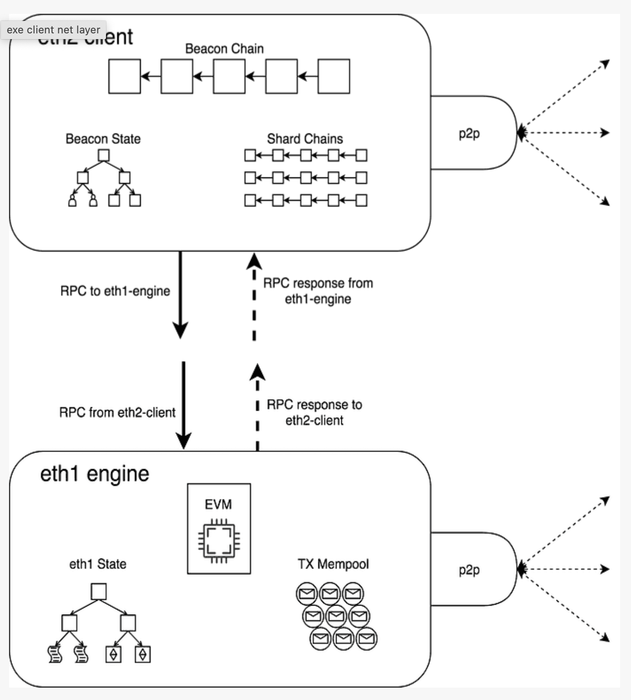

# **Networking**

## **1. CONNECTING THE EXECUTION AND CONSENSUS CLIENTS**

### **a. When consensus client is not block producer:**

- Consensus client receives a block via the block gossip protocol (consensus p2p)
- Consensus client pre-validates the block, i.e. ensures it arrived from a valid sender with correct metadata
- The transactions in the block are sent to the execution layer as an execution payload (local RPC connection)
- The execution layer executes the transactions and validates the state in the block header (i.e. checks hashes match)
- Execution layer passes validation data back to consensus layer, block now considered to be validated (local RPC connection)
- Consensus layer adds block to head of its own blockchain and attests to it, broadcasting the attestation over the network (consensus p2p)

### **b. When consensus client is block producer:**

- Consensus client receives notice that it is the next block producer (consensus p2p)
- Consensus layer calls create block method in execution client (local RPC)
- Execution layer accesses the transaction mempool which has been populated by the transaction gossip protocol (execution p2p)
- Execution client bundles transactions into a block, executes the transactions and generates a block hash
- Consensus client grabs the transactions and block hash from the execution client and adds them to the beacon block (local RPC)
- Consensus client broadcasts the block over the block gossip protocol (consensus p2p)
- Other clients receive the proposed block via the block gossip protocol and validate as described above (consensus p2p)

---

## **2. THE EXECUTION LAYER**

- The execution layer's networking protocols is divided into two stacks:
  - the discovery stack: built on top of UDP and allows a new node to find peers to connect to
  - the DevP2P stack: sits on top of TCP and enables nodes to exchange information
  - Both stacks work in parallel. The discovery stack feeds new network participants into the network, and the DevP2P stack enables their interactions.

### **a. Discovery:**

- Discovery is the process of finding other nodes in network. This is bootstrapped using a small set of bootnodes (nodes whose addresses are hardcoded(opens in a new tab) into the client so they can be found immediately and connect the client to peers)

  - => These bootnodes only exist to introduce a new node to a set of peers - this is their sole purpose, they do not participate in normal client tasks like syncing the chain, and they are only used the very first time a client is spin up.

- The protocol used for the node-bootnode interactions is a modified form of **Kademlia** which uses a distributed hash table to share lists of nodes.
- Each node has a version of this table containing the information required to connect to its closest peers => This 'closeness' is not geographical - distance is defined by the similarity of the node's ID.
- Each node's table is regularly refreshed as a security feature

- Discovery starts with a game of PING-PONG. A successful PING-PONG "bonds" the new node to a bootnode.

  - The initial message that alerts a bootnode to the existence of a new node entering the network is a PING.
  - This PING includes hashed information about the new node, the bootnode and an expiry time-stamp.
  - The bootnode receives the PING and returns a PONG containing the PING hash.
  - If the PING and PONG hashes match then the connection between the new node and bootnode is verified and they are said to have "bonded".

- Once bonded, the new node can send a FIND-NEIGHBOURS request to the bootnode.

  - The data returned by the bootnode includes a list of peers that the new node can connect to.
  - If the nodes are not bonded, the FIND-NEIGHBOURS request will fail, so the new node will not be able to enter the network.

- Once the new node receives a list of neighbours from the bootnode, it begins a PING-PONG exchange with each of them

  - => Successful PING-PONGs bond the new node with its neighbours, enabling message exchange.

- FLow:
  start client --> connect to bootnode --> bond to bootnode --> find neighbours --> bond to neighbours

- Execution clients are currently using the Discv4 discovery protocol
  https://github.com/ethereum/devp2p/blob/master/discv4.md

### **b. ENRs: Ethereum Node Records**

- The Ethereum Node Record (ENR) is an object that contains three basic elements:
  - a signature (hash of record contents made according to some agreed identity scheme)
  - a sequence number that tracks changes to the record
  - an arbitrary list of key:value pairs.
- This is a future-proof format that allows easier exchange of identifying information between new peers and is the preferred network address format for Ethereum nodes.

### **c. DevP2P**

- DevP2P is itself a whole stack of protocols that Ethereum implements to establish and maintain the peer-to-peer network
- After new nodes enter the network, their interactions are governed by protocols in the DevP2P stack
  https://github.com/ethereum/devp2p
- DevP2P sit on top of TCP and include the RLPx transport protocol, wire protocol and several sub-protocols

#### **RLPx protocol**

- RLPx is the protocol governing initiating, authenticating and maintaining sessions between nodes.
- RLPx encodes messages using RLP (Recursive Length Prefix) which is a very space-efficient method of encoding data into a minimal structure for sending between nodes.
- A RLPx session between two nodes begins with an initial cryptographic handshake:

  - initiator node sending an auth message which is then verified by the peer.
  - On successful verification, the peer generates an auth-acknowledgement message to return to the initiator node
  - This is a key-exchange process that enables the nodes to communicate privately and securely
  - A successful cryptographic handshake then triggers both nodes to send a "hello" message to one another "on the wire". The wire protocol is initiated by a successful exchange of hello messages.

  - The hello messages contain:

    - protocol version
    - client ID
    - port
    - node ID
    - list of supported sub-protocols

  - -> This is the information required for a successful interaction because it defines what capabilities are shared between both nodes and configures the communication.
  - -> There is a process of sub-protocol negotiation where the lists of sub-protocols supported by each node are compared and those that are common to both nodes can be used in the session.

  - Along with the hello messages, the wire protocol can also send a "disconnect" message that gives warning to a peer that the connection will be closed

  - The wire protocol also includes PING and PONG messages that are sent periodically to keep a session open.

- => The RLPx and wire protocol exchanges therefore establish the foundations of communication between the nodes, providing the scaffolding for useful information to be exchanged according to a specific sub-protocol.

#### **Sub-protocols:**

- **Wire protocol**:

  - Once peers are connected, and an RLPx session has been started, the wire protocol defines how peers communicate.
  - Initially, the wire protocol defined three main tasks: chain synchronization, block propagation and transaction exchange.
    NOTE: eth2 - execution clients now only doing 1 task: transaction exchange => no more chain synchronization, block propagation tasks (they are now tasks of consensus clients)
  - Transaction exchange refers to exchanging pending transactions between nodes so that miners can select some of them for inclusion in the next block.
  - https://github.com/ethereum/devp2p/blob/master/caps/eth.md

- **les** (light ethereum subprotocol) -> this protocol has rarely been used because full nodes are required to serve data to light clients without being incentivized

- **Snap** protocol is an optional extension that allows peers to exchange snapshots of recent states, allowing peers to verify account and storage data without having to download intermediate Merkle trie nodes.

- **Wit** (witness protocol) is an optional extension that enables exchange of state witnesses between peers, helping to sync clients to the tip of the chain.

- **Whisper** was a protocol that aimed to deliver secure messaging between peers without writing any information to the blockchain -> deprecated

---

## **3. THE CONSENSUS LAYER**

- Consensus clients need to participate in block gossip so that they can receive new blocks from peers and broadcast them when it is their turn to be block proposer.
- Similar to the execution layer, this first requires a discovery protocol so that a node can find peers and establish secure sessions for exchanging blocks, attestations etc.

### **a. Discovery:**

- Similar to the execution clients, consensus clients use "discv5 protocol" over UDP for finding peers.
  https://github.com/ethereum/consensus-specs/blob/dev/specs/phase0/p2p-interface.md#the-discovery-domain-discv5

- The consensus layer implementation of discv5 differs from that of the execution clients only in that it includes an adaptor connecting discv5 into a libP2P stack, deprecating DevP2P. The execution layer's RLPx sessions are deprecated in favour of libP2P's noise secure channel handshake.

  https://docs.libp2p.io/concepts/introduction/overview/

- ENRs: Ethereum Node Records

  - The ENR for consensus nodes includes:
    - the node's public key,
    - IP address, UDP and TCP ports
    - two consensus-specific fields: the attestation subnet bitfield and eth2 key.

  -> The former makes it easier for nodes to find peers participating in specific attestation gossip sub-networks. The eth2 key contains information about which Ethereum fork version the node is using, ensuring peers are connecting to the right Ethereum.

### **b. libP2P**

- The libP2P stack supports all communications after discovery.
- Clients can dial and listen on IPv4 and/or IPv6 as defined in their ENR.
- The protocols on the libP2P layer can be subdivided into the gossip and req/resp domains:

  - Gossip:

    - The gossip domain includes all information that has to spread rapidly throughout the network. This includes beacon blocks, proofs, attestations, exits and slashings.
    - This is transmitted using libP2P gossipsub v1 and relies on various metadata being stored locally at each node, including maximum size of gossip payloads to receive and transmit

      https://github.com/ethereum/consensus-specs/blob/dev/specs/phase0/p2p-interface.md#the-gossip-domain-gossipsub

  - Request-response

    - The request-response domain contains protocols for clients requesting specific information from their peers.
    - Examples include requesting specific Beacon blocks matching certain root hashes or within a range of slots. The responses are always returned as snappy-compressed SSZ encoded bytes.

    - WHY DOES THE CONSENSUS CLIENT PREFER SSZ TO RLP?
      - -> SSZ stands for simple serialization. It uses fixed offsets that make it easy to decode individual parts of an encoded message without having to decode the entire structure, which is very useful for the consensus client as it can efficiently grab specific pieces of information from encoded messages.
      - -> It is also designed specifically to integrate with Merkle protocols, with related efficiency gains for Merkleization. Since all hashes in the consensus layer are Merkle roots, this adds up to a significant improvement.
      - -> SSZ also guarantees unique representations of values.
