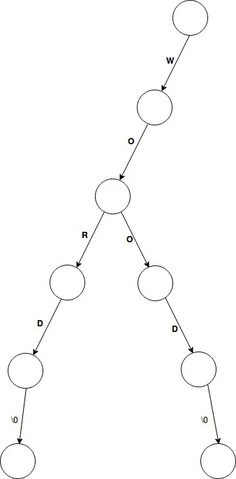
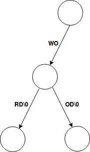
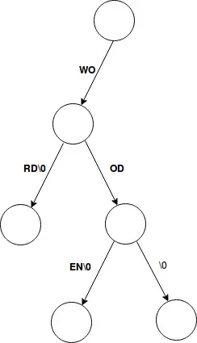
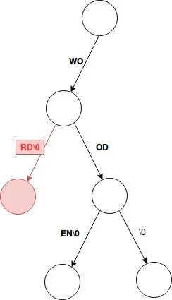
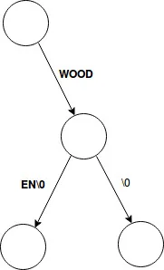

# **Data Structure And Encoding - Patricia Trie**

## **1. The trie (or tree)**

- The trie (or tree) is a well known data structure which is used for storing sequences of characters.

 

 

### **a. Rules for adding a word to the trie**

- We follow the search path for the word we are adding.
- If we encounter a null pointer, we create a new node.
- When we have finished adding our word we create a null pointer (terminator).
- When adding a (shorter) word which is contained in another (longer) word, we just remove all of the characters and then add a null pointer (terminator)

### **b. Rules for deleting a word from the trie**

- We search for for a leaf (the very end of a branch) on the trie that represents the string (which we are wanting to delete).
- We then start deleting all nodes from the leaf back to the root of the trie.
- Unless we hit a node with more than one child; in this case we stop.

### **c. Rules for searching for a word in the trie**

- We examine each of the characters in the string for which we are searching and follow the trie for as long as it provides our path (in the right sequence).
- If we encounter a null pointer before exhausting all of the characters in the string (which we are searching for) -> We can conclude that the string is not stored in the trie.
- On the contrary, if we reach a leaf (the end of a branch) and that path (from the leaf back to the root of the trie) represents out string -> We conclude that the string is stored in the trie.

---

## **2. Patricia Trie**

- Patricia tries group all common characters into a single branch. Any non common characters will constitute a new branch in the path

 

 

### **a. Rules for adding a word to the Patricia trie**

- When adding a word to a Patricia trie we exhaust all of the characters and then add the null pointer (terminator).

 

 

### **b. Rules for deleting a word from the Patricia trie**

- Same as with a traditional trie, except for when deleting nodes (from the leaf back to the root) we must ensure that all parent nodes must be in possession of at least 2 child nodes

  - It is OK for a single child node to just have characters and a null pointer (this occurs in the diagram above, at the very end of every word).
  - It is also OK for a single node to just have a null pointer (this occurs if a shorter word is contained in a longer word). See diagram above which illustrates how “wood” and “wooden” co-exist in the same trie.

- Importantly, when deleting from a trie, a path can not be left with a parent nodes which just connects to single child node. => If this occurs when deleting, we need to concatenate the appropriate characters to resolve this. => This is illustrated in the diagram below (where we delete the word “word” from the trie).

 

 
Before deleting the word “word” from the trie

 

 

 
After — reorganization of trie as part of delete

 

### **c. Rules for searching for a word in the Patricia trie**

- The rules for searching the Patricia trie are the same as for searching the standard trie.

## **3. Similarities between the trie and Patricia trie**

- The run time “O” for adding is O(mN) where “m” is the length of the string we are adding and “N” is the size of the available alphabet
- The run time for deleting is O(mN) where “m” is the length of the string which we want to delete and “N” is again the size of the available alphabet
- The run time for searching is O(m) where “m” is the length of the string we are searching for

## **4. Main difference between the trie and Patricia trie**

The main advantage of using the Patricia trie is in relation to storage.

- The storage requirement “O” for the standard trie is O(MN) where “M” is the total length of all strings in the trie and “N” is the size of the available alphabet.

- The storage requirement “O” for the Patricia trie is O(nN+M) where “n” is the number of strings stored in the Patricia trie, “N” is the size of the available alphabet and “M” is the total length of all strings in the trie.
