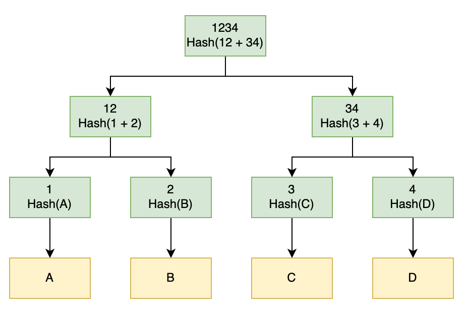
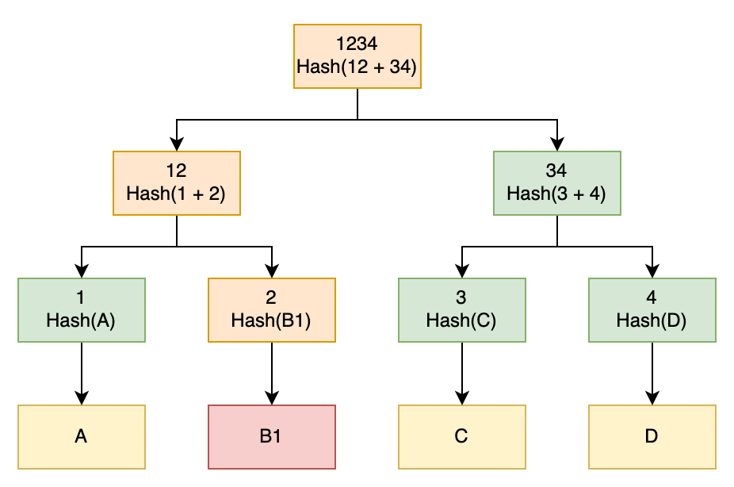
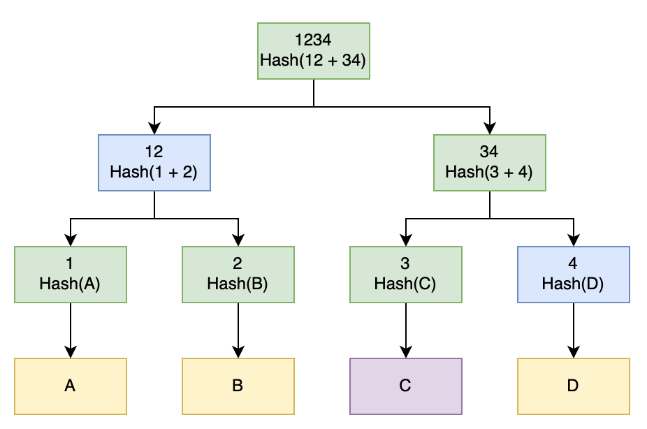

# **Data Structure And Encoding - Merkle Tree**

## **1. Merkle Tree (Hash Trees)**

- Merkle Trees is a construct used for generating hashes of large amounts of data.
- This works whether it’s a single large file, a lot of small files, or any scenario where we have a significant amount of data.
- A Merkle Tree is a tree of hash values. Parent node is a hash of its child nodes.
- These data structures have two major purposes:
  - Efficiently verifying that a large amount of data is unchanged and finding exactly where any changes may have occurred
  - Efficiently proving that a piece of data is present in a larger data set

 

 

## **2. Verifying Data Integrity**

- Merkle Trees can be an efficient way to verify the integrity of large quantities of data without re-generate the tree (from all orginal data) and then compare the top hash from this to the top hash from the original data.

 

 

- We download file from 4 chunk files (A,B,C,D). When we generate the top hash for this file, we will see that it differs from top hash of the original file => tells us that something is wrong.
- Given this, we can then compare the next level of the tree. Here we will see that node “12” differs between the two trees, but “34” is the same => something is wrong on the “12” side of the tree
- Again, we now compare the next level of this subtree. Here we see that node “1” is the same, but node “2” is different => data block “B1” is corrupted

- => We have now determined, from the original data blocks, exactly which of them are corrupted. This means that we can re-download only these blocks and replace them, and now we have the correct data

## **3. Proving Data Presence**

- Another use for Merkle Trees is to efficiently prove that a piece of data is present in the original set.
- For example, to prove that one particular transaction was present in a larger set of transactions within a blockchain.
- **=> We can do this using the exact opposite technique of verifying the data integrity.**

 

 

- To prove that block C is a piece of total data.

  - combine hash for block C with the provided hash “4” => produce hash “34”
  - then combine hash “34” with hash “12” to produce hash “1234”
  - then compare hash “1234” with original top hash “1234”

- => That means we don't need to re-generate the hash tree from all orginal data
