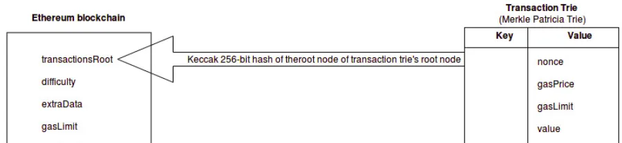

# **Data Structure And Encoding - Merkle Patricia Tries**

## **1. Merkle Patricia Tries (MPT)**

- https://medium.com/coinmonks/merkle-tree-a-simple-explanation-and-implementation-48903442bc08

### **a. 4 different merkles Tries**

- **Transaction Trie**

  - its purpose is to record transactions.
  - The ordering of the data is mostly decided upon by the miner
  - We do know what parameters are used to compose the transaction trie, and they’re as follows:
    - Account nonce
    - Gas price
    - Gas limit
    - Recipient
    - Transfer value
    - Transaction signature values
    - Account initialization (if transaction is of contract creation type), or transaction data (if transaction is a message call)
    - The path to a specific transaction in the transaction trie, is via (the RLP encoding of) the index of where the transaction sits in the block

  NOTE: Transaction Trie is specific to a particular block -> Once the block is mined, the transaction trie is never updated

 

 

- **Receipt Trie**

  - its purpose it to record the outcome of a transaction.
  - According to the yellow paper, the receipt trie can also be useful for zero-knowledge proofs or searches.
  - The parameters that make up the receipt trie are as follows:
    - Post-transaction state
    - Cumulative gas used
    - Logs
    - Bloom filter created from the information of the above logs

  **NOTE**: Receipt Trie is specific to a particular block -> Once the block is mined, the Receipt trie is never updated

- **State Trie**

  - The one and only one global state trie.
  - It contains a key-value pair for every Ethereum account on the network
    - The “key” is a single 160 bit identifier (the address of an Ethereum account)
    - value is RLP encoded of account's details. An ethereum account and the state trie is comprised of the following fields:
      - Nonce
      - Balance
      - Storage Root
      - Codehash
  - Unlike the transaction and receipt tries, the state trie updates over time….constantly.

 

Relationship between the State Trie (leveldb implementation of a Merkle Patricia Trie) and an Ethereum block

 

- **Storage Trie** (also known as the Contract Storage Trie)

  - is a data structure that represents the storage of an individual smart contract.
  - It stores the key-value pairs that define the persistent state of a contract
  - Each smart contract on Ethereum has its own Storage Trie, and it is specific to that contract
  - When a smart contract is deployed or executed, its storage state is stored and managed within the Storage Trie.
  - Unlike the transaction and receipt tries, the Storage Trie is not specific to a particular block, the state trie updates over time….constantly.

- -> The root for each of the tries is a Keccak 256-bit hash
- -> The Storage Tree’s root lives within the RLP encoded data value within the State Trie

 

 

### **b. Merkles roots nodes included in block's header:**

- state Root
- transaction Root
- receipts Root

 

 

### **c. Use cases:**

- Has this transaction been included in a particular block? -> Transaction Tree
- Tell me all instances of an event of type X (eg. a crowdfunding contract reaching its goal) emitted by this address in the past 30 days -> Receipt tree.
- What is the current balance of my account? -> State Tree
- Does this account exist? -> State Tree
- Pretend to run this transaction on this contract. What would the output be? -> State Tree

---

## **2. Tries Architecture**

---

## **3. Merkle Patricia Tries (MPT)**

### **a. Node type:**

- empty nodes
  - a blank node
- branch nodes
  - any node with 1 or more branches
  - branch node can have leaf node and extension node in branch
- extension nodes
  - branch node with 1 child is compressed
  - store key-value
- leaf nodes

  - node that doesnt have child
  - store key-value

- Nibble:
  - leaf & extension nodes are same as both contain key-value pair -> how we recognize whether the node is leaf or extension => Nibble help us there

