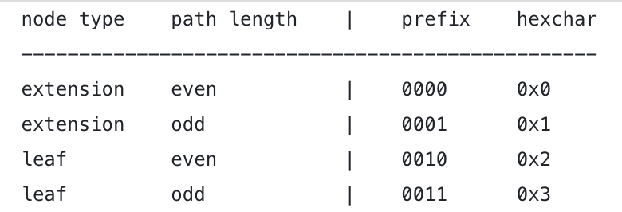

# **Data Structure And Encoding - Compact encoding or Hex-prefix (HP)**

## **Hex-prefix (HP)**

- Think of Hex Prefix as an encoding/decoding mechanism of the **Path** to a given **Value** in the Ethereum network.

  => in Plain English - it means that _"I know a way to get to this house and here is the way of storing the map to the house"_

## **1. Some terminologies**

- Let’s play a game. Giving a map:
  > **Root**: {1: 'Dog', 2: B, 3: A}
  >  **A**: {1: C, 2: D, 3: 'Cat'}
  >  **B**: {1: 'Goat', 2: 'Bear', 3: 'Rat'}
  >  **C**: {1: 'Eagle', 2: 'Parrot', 3: E}
  >  **D**: {1: 'Shark', 2: 'Dolphin', 3: 'Whale'}
  >  **E**: {1: 'Duck', 2: 'Chicken', 3: 'Pig'}
- And a path:
  > 3–2–3
- Find the animal which the path is implying? => Result: **'Whale'**
- Let’s try another path:
  > 3–1–3–2
- Result: **'Chicken'**

### **By this game we get familiar with some terminologies**:

- **Key**: Root, A, B, C, D and E
- **Node**: the content corresponding with the key in the right part of each row.

  - Ex:
    > **key**: Root - **node**: {1: ‘Dog’, 2: B, 3: A}.

- **Path**: a routing from Root. Ex: 2–2–3.
- **Value**: there're some elements in all nodes, every element is a key-value pair => **Value** is the right part of element.
  - Value can be a **key** or **a name of animal**.
  - Ex: node {1: ‘Dog’, 2: B, 3: A} => the values are ‘Dog’, B, A
- **Nibble**: is a hex form of 4 bits. For example: 0x1, 0x4, 0xf …

## **2. Differentiate RLD from HP**

- RLP is used for encoding/decoding **Value**
- HP is used for encoding/decoding **Path**

## **3. HP encoding goals**

- [Merkle Patricia Tries (MPT)](/6.5-DataStructures-Merkle-Patricia-Tries.md) has 4 types of Node :
  - empty nodes
    - a blank node (NULL)
  - branch nodes
    - any node with 1 or more branches
    - branch node can have leaf node and extension node in branch
  - extension nodes
    - branch node with 1 child is compressed
  - leaf nodes
    - node that doesnt have child
    - has **terminator**
- leaf nodes has **terminator** and extension nodes does not
- **terminator** is the **last byte of the path** and has value of **16** in dec or **0x10** in hex
- As we can see, it’s possible to the **path** has odd length but odd length is not friendly to machines. So we have to **convert all odd-length paths to even-length paths**.

> In summary, HP encoding goals are:
>
> - 1. Distinguish MPT **leaf** node and **extension** node from each other by **terminator**
> - 2. Convert the **path** to **even** length

## **4. HP encoding specification**

- 1. If path inputed in HP encoding doesn't have terminator => extension node
- 2. If path inputed in HP encoding has terminator => leaf node => remove terminator from input
- 3.  Create the prefix for inputed path with value as following table:

- 4. If the prefix is **0x0** or **0x2** => add a padding nibble **0** follow the prefix, so the prefix is **0x00** and **0x20**
  - => The main reason to do that is we are trying to maintain the even-length attribute of the path
- 5. Add prefix to inputed path

> Example:
>
> - input: [ 1, 2, 3, 4, 5]
>   - extension node (not ending with terminator 0x10), odd length => prefix 0x1
>   - result: '11 23 45'
> - input: [ 0, 1, 2, 3, 4, 5]
>   - extension node (not ending with terminator 0x10), even length => prefix 0x0 => add padding nibble 0 => prefix: 0x00
>   - result: '00 01 23 45'
> - input: [ 0, f, 1, c, b, 8, 10]
>   - leaf node (ending with terminator 0x10)
>   - remove terminator : [ 0, f, 1, c, b, 8] => even length => prefix 0x2 => add padding nibble 0 => prefix: 0x20
>   - result: '20 0f 1c b8'
> - input: [ f, 1, c, b, 8, 10]
>   - leaf node (ending with terminator 0x10)
>   - remove terminator : [ f, 1, c, b, 8] => odd length => prefix 0x3
>   - result: '3f 1c b8'
