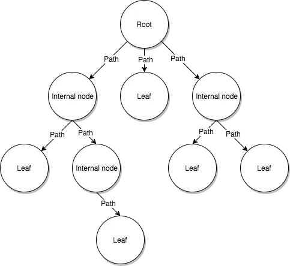
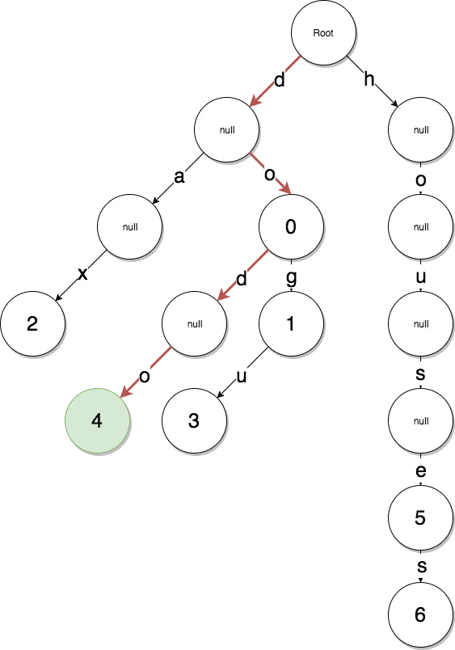

# **Data Structure And Encoding - Radix trie**

## **1. Trie**

- Trie is an ordered data structure that is used to store a dynamic set or associative array which is formed to key-value where the keys are usually strings

## **2. Radix trie**

- Radix trie is used to optimize for searching

  > We will use this data set for all examples:
  >
  > { 
  > do: 0, 
  > dog: 1, 
  > dax: 2, 
  > dogu: 3, 
  > dodo: 4, 
  > house: 5, 
  > houses: 6 
  > } 
  > => In dataset, key is strings and value is integers.

- In radix trie, the **key** in dataset will be the **path** to reach the **value**
- Every path of trie represents a character which is ASCII and it is used for searching value

 Example: looking for the value of key "dodo"

- However, the branch of **house** and **houses** key was degraded, too many internal nodes with null value. In order to reach the value of **houses** , we have to descend down the path so many times => It causes wasted space.

- So, it can be improved by **combining the degraded path**. Now, a **path** is not represented by a single character, instead of that a string.

 Improvement on radix trie => To reach houses node, we just need to descent twice

