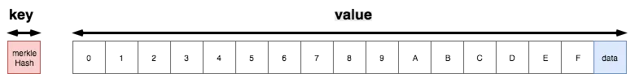
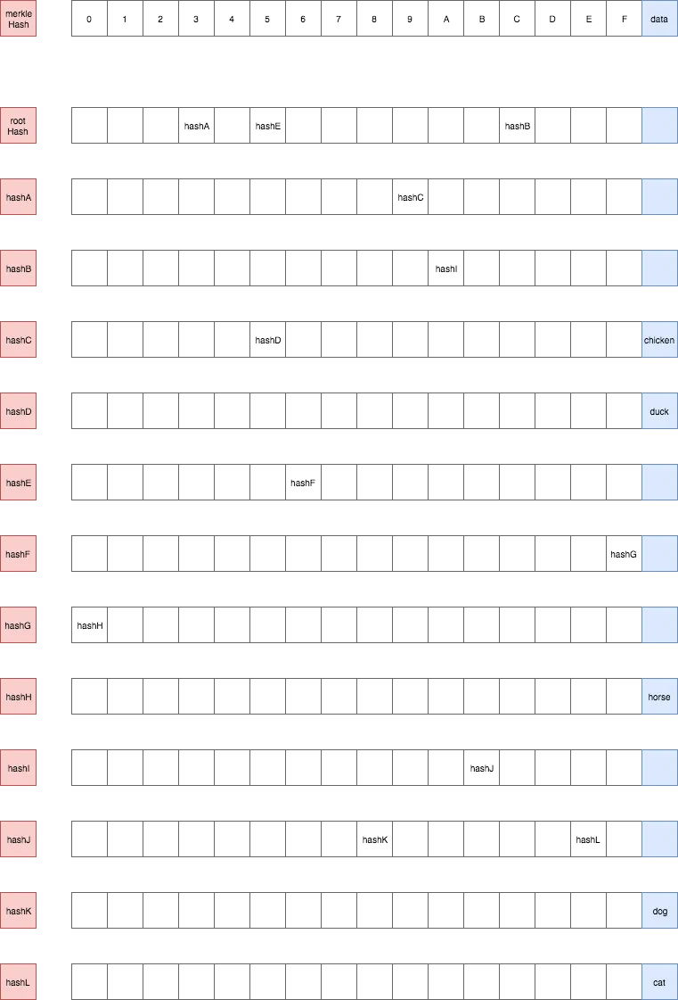
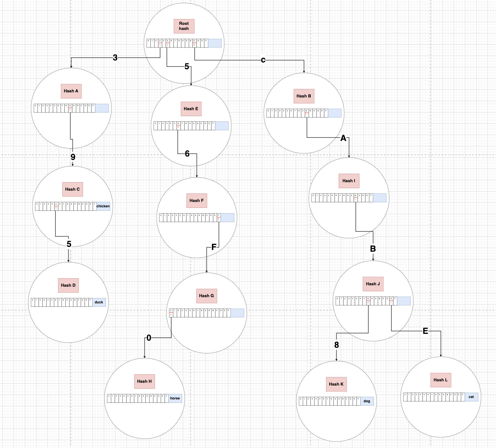
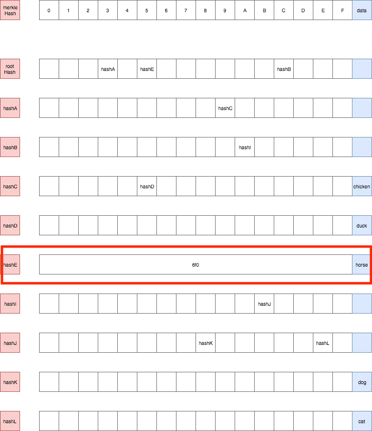
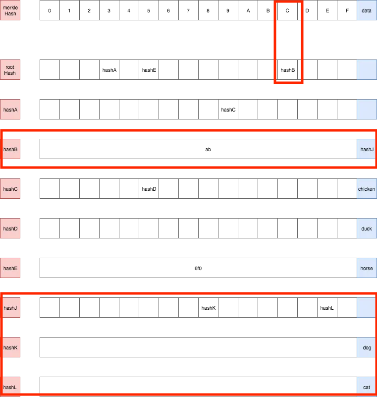
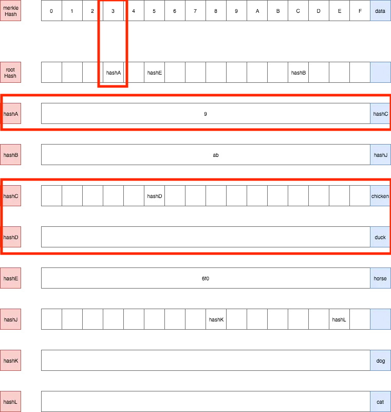
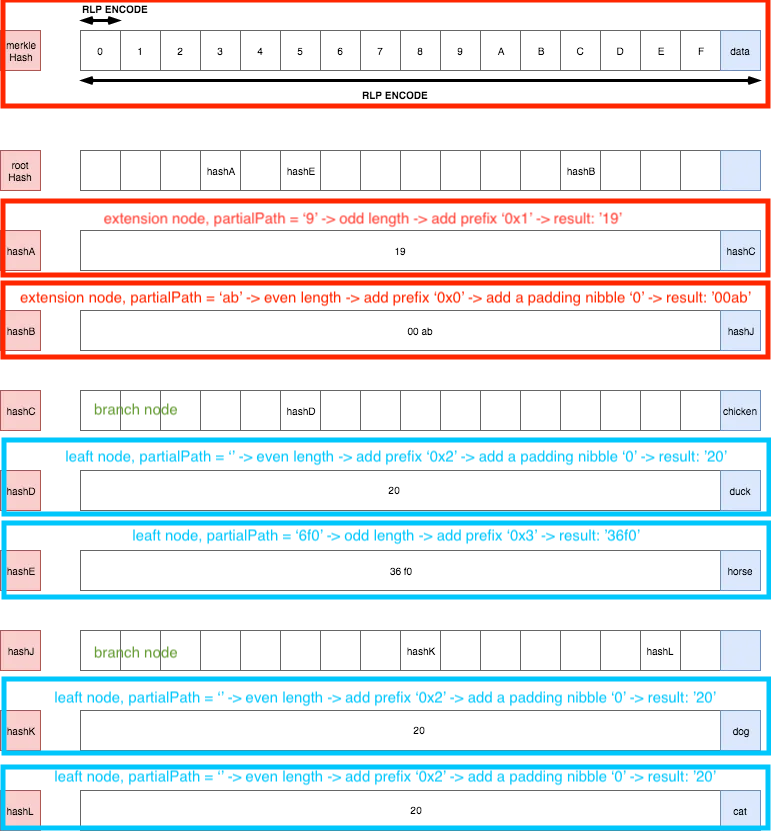
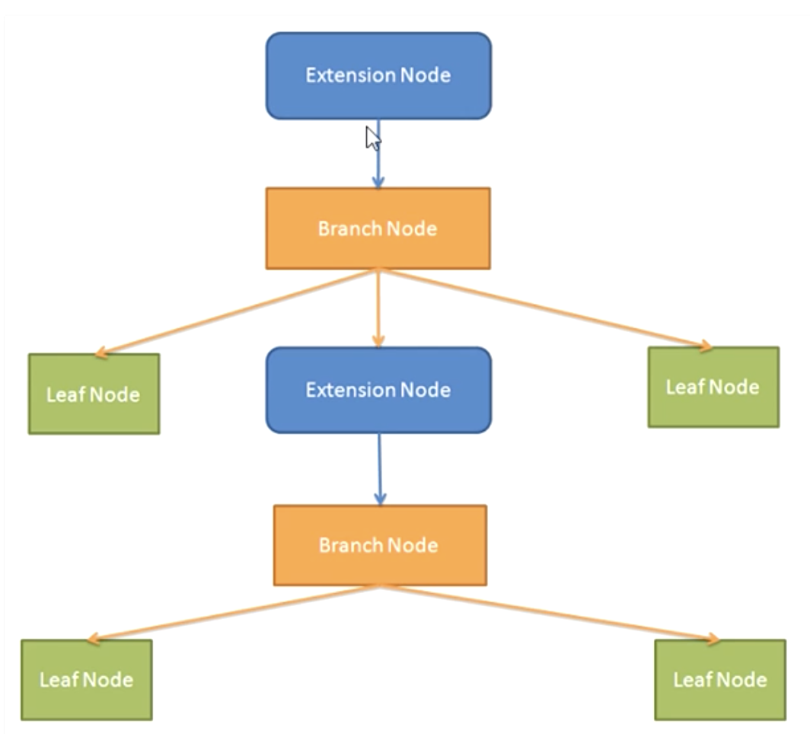
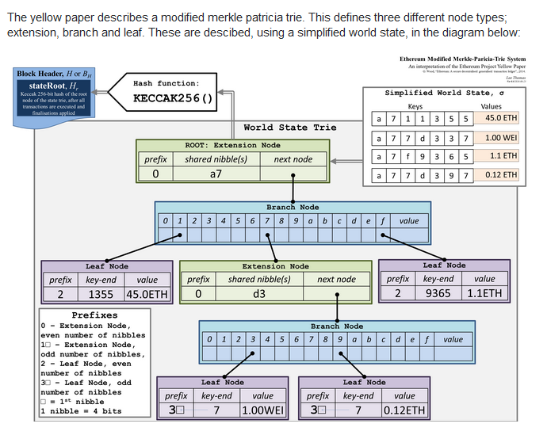

# **Data Structure And Encoding - Merkle Patricia Tries**

https://ethereum.org/en/developers/docs/data-structures-and-encoding/patricia-merkle-trie/

## **1. Terminologies:**

- A node in Ethereum is stored as a key-value with key is hash of node. Value is an array with 17 elements. In 17 elements, first 16 elements are indexed by hex number from 0 to f and the last one is data contained by that node.

### IMPORTANT NOTE: **key vs path**

- **key** is used for “database lookup” (it means to find a node by database mechanism)
- **path** is used for “trie lookup” (it means to find data by path descending as [Radix trie](/6.5-DataStructures-Radix-Trie.md))

### **a. Example data set**

> { 
> 'cab8': 'dog', 
> 'cabe': 'cat', 
> '39': 'chicken', 
> '395': 'duck', 
> '56f0': 'horse' 
> }

### **b. Inefficient Patricia trie**

- We build a trie that represents our dataset.

#### **Exampe workflow**

- Let’s try searching the value of 395 path step by step

- Workflow:
  - 1. We descend path 395 to 3 parts 3, 9, 5 and use them in sequence.
  - 2. Starting at **rootHash**, we have to find **rootNode** corresponding with rootHash => _this is database lookup_
  - 3. First part of path is 3, so we get the element indexed by 3 of **rootNode** and that is hashA => _this is trie lookup_
  - 4. Looking for hashA (_database lookup_), getting element indexed by 9 (_trie lookup_) and value of element is hashC
  - 5. Looking for hashC (_database lookup_), getting element indexed by 5 (_trie lookup_) and value of element is hashD
  - 6. At this time, we descend entire the path so we will get value contained in data element (the last element) of node corresponding with hashD (_trie lookup_) => the result is 'duck'

#### **Summary**

- We used **path** to find the **value** (an attribute of Radix trie) and if a value in **trie** is changed => it will cause the **rootHash** of trie changed (an attribute of Merkle trie)
- Moreover, trie has so many nodes with null value in data element => We have to improve it for more efficiency.

### **c. “Improved” Patricia trie**

- Problem: Trie has so many nodes with null value in data element => We met situation that make our trie become degraded -> the long paths without branch (no divergent path). This leads to 2 sub-problems:

  - No divergent path points to a data at the end. For example: '56f0'
  - No divergent path is branched in the middle. For example: 'cab' of {cabe, cab8}

- Solution
  - To solve the 1st sub-problem they introduced **leaf** node.
  - To solve the 2nd one they introduced **extension** node
  - They are nodes in form of an array with 2 elements:
    - The first element is **partialPath** that helps to reduce empty-value node
    - The second one contains value that is:
      - **data** if node is a **leaf**
      - **merkleHash** if node is an **extension**

#### **_Optimize path '56f0'_**

 

- hashE now becomes a **leaf** node
- To get value of path '56f0':
  - Getting element with index 5 of rootHash and the value is hashE => remainder path '6f0'
  - Because hashE may be a leaf or extension node, we have to compare the rest of path ('6f0') to **partialPath** of hashE ('6f0') => they are the same => this node is **leaf** node => We return **data** field and result is 'horse'

#### **_Optimize path 'cab8' & 'cabe'_**

 

- hashB now becomes a **extension** node.
- To get value of path 'cab8':
  - Getting element indexed by c of rootHash, value is hashB => remainder path 'ab8'
  - Check hashB is a leaf or extension node => comparing remainder path ('ab8') with **partialPath** of hashB ('ab') => they are the same => this node is **extension** node => Remove **partialPath** ('ab') from the current rest of path => remainder path '8'
    - data of hashB is hashJ => go to the hashJ
  - Finding node corresponding with hashJ (_database lookup_), getting element indexed 8 (trie lookup\_), the value is hashK => go to the hashK => remainder path '' (empty)
  - Finding hashK and we are received a node with empty partialPath => leaf node because remainder path is equal to partialPath => return 'dog'

#### **_Optimize path '39' & '395'_**

 

## **2. Building Patricia trie**

Some additional rules:

- 1. Every **partialPath** will be [HP encoded](/6.4-DataStructures-HP.md)
- 2. Every elements in a node will be [RLP encoded](/6.3-DataStructures-RLP.md)
- 3. Value (Node) will be RLP encoded before stored down

 

## **3. Node type:**

- empty nodes
  - a blank node (NULL)
- branch nodes
  - any node with 1 or more branches
  - branch node can have leaf node and extension node in branch
  - an array which contains 17 items
- extension nodes
  - branch node with 1 child is compressed
  - store key-value
  - an array which contains 2 items
- leaf nodes
  - node that doesnt have child
  - store key-value
  - an array which contains 2 items
  - has **terminator**

- Nibble:
  - leaf & extension nodes are same as both contain key-value pair -> how we recognize whether the node is leaf or extension => Nibble help us there

