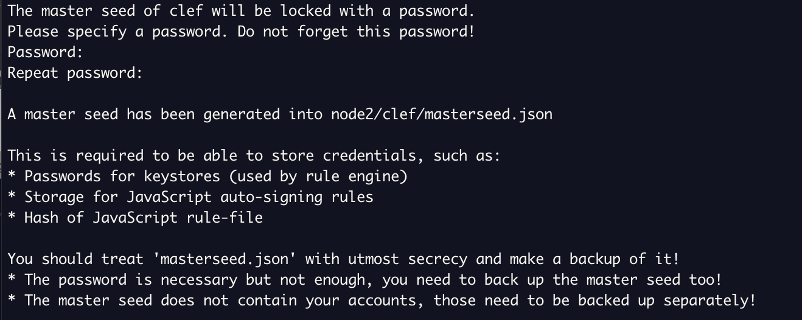
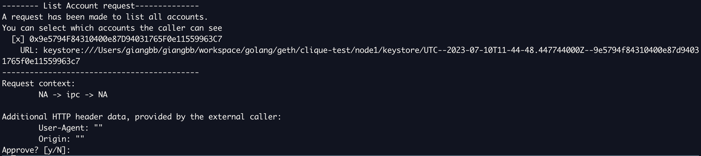
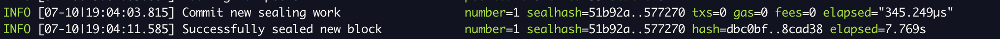
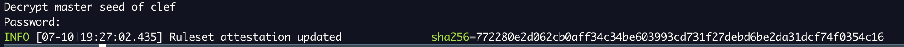
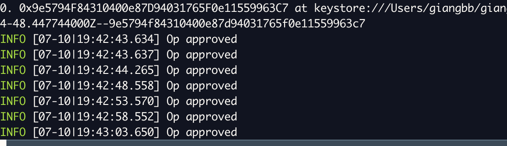
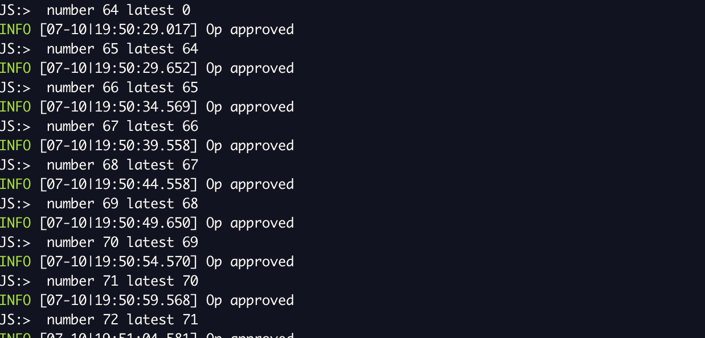

# **Running a Proof of authority network**

## **Lab 2 - Accounts management with Clef**

- Clique is a proof-of-authority system where new blocks can be created by authorized ‘signers’ only. The initial set of authorized signers is configured in the genesis block. Signers can be authorized and de-authorized using a voting mechanism, thus allowing the set of signers to change while the blockchain operates

- Signing blocks in Clique networks classically uses the "unlock" feature of Geth so that each node is always ready to sign without requiring a user to manually provide authorization

- However, using the --unlock flag is generally a highly dangerous thing to do because it is indiscriminate, i.e. if an account is unlocked and an attacker obtains access to the RPC api, the attacker can sign anything without supplying a password.

  > Clef provides a way to safely circumvent --unlock while maintaining a enough automation for the network to be useable.

- I, this lab we're going to run:
  - 1 bootnode
  - 1 full node as validator
  - 1 full node
  - Node accounts are managed by Clef.

## **What is Clef**

- https://geth.ethereum.org/docs/tools/clef/introduction
- Clef is a tool for signing transactions and data in a secure local environment.
- It is intended to become a more composable and secure replacement for Geth's built-in account management.
- Clef decouples key management from Geth itself, meaning it can be used as an independent, standalone key management and signing application, or it can be integrated into Geth.
- Clef can be used safely in situations where access to Ethereum is via a remote and/or untrusted node because signing happens locally, either manually or automatically using custom rulesets.
- The separation of Clef from the node itself enables it to run as a daemon on the same machine as the client software, on a secure usb-stick like USB armory, or even a separate VM in a QubesOS type setup.

## **Steps**

**1. Clone go-ethereum**

> git clone https://github.com/ethereum/go-ethereum.git

**2. Build geth**

> make all

**3. Create folders for storing chain's data**

> mkdir node1 node2

**4. Create accounts**

- Create account for node 1 => _this is validator_

  > geth --datadir node1 account new
  >   => 0x9e5794F84310400e87D94031765F0e11559963C7

- Create account for node 2

  > geth --datadir node2 account new
  >   => 0x5c5bb8fD262840aeee488440EaBdD65683978aB5

**5. Create genesis.json**

- set node 1 as validator
- set gaslimit 30M
- premined some eth (10^18)

        {
          "config": {
            "chainId": 1234511118888,
            "homesteadBlock": 0,
            "eip150Block": 0,
            "eip155Block": 0,
            "eip158Block": 0,
            "byzantiumBlock": 0,
            "constantinopleBlock": 0,
            "petersburgBlock": 0,
            "istanbulBlock": 0,
            "muirGlacierBlock": 0,
            "berlinBlock": 0,
            "londonBlock": 0,
            "arrowGlacierBlock": 0,
            "grayGlacierBlock": 0,
            "clique": {
              "period": 5,
              "epoch": 30000
            }
          },
          "difficulty": "1",
          "gasLimit": "30000000",
          "extradata": "0x00000000000000000000000000000000000000000000000000000000000000009e5794F84310400e87D94031765F0e11559963C70000000000000000000000000000000000000000000000000000000000000000000000000000000000000000000000000000000000000000000000000000000000",
          "alloc": {
            "eD19d9CE7392A7f2262a67817E0DBAF68dF042b8": {
              "balance": "1000000000000000000000000"
            },
            "146142AFF24195Aea62C84c88017e543c7342911": {
              "balance": "1000000000000000000000000"
            },
            "9e5794F84310400e87D94031765F0e11559963C7": {
              "balance": "500000000000000000000"
            }
          }
        }

**6. Initializing the Geth Database**

- To create a blockchain node that uses this genesis block, first use **geth init** to import and sets the canonical genesis block for the new chain. This requires the path to **genesis.json** to be passed as an argument.

  > geth init --datadir node1 genesis.json
  >
  > geth init --datadir node2 genesis.json

**7. Prepping Clef**

- In order to make use of clef for signing:

  - Ensure clef knows the password for the keystore.
  - Ensure clef auto-approves clique signing requests.
  - => These two things are independent of each other.

- **Init clef for node 1**

  > clef --keystore node1/keystore --configdir node1/clef --chainid 1234511118888 --suppress-bootwarn init
  >   -> enter password (Clef requires a password that is at least 10 characters long, and best practice would be to use a combination of numbers, characters and special characters)

  

  
  

- **Storing passwords in clef for node 1**

  > $ clef --keystore node1/keystore --configdir node1/clef --chainid 1234511118888 --suppress-bootwarn setpw 0x9e5794F84310400e87D94031765F0e11559963C7
  >   -> ok
  >   -> enter password/Repeat password to store for account in clef
  >   -> confirm by enter password master seed of clef (password when we init clef for node1)

  - **NOTE**:
    - When clef promt this "Please enter a password to store for this address:" => must input password that used to create account

  

  
  

**7. Testing stored password**

- Start clef
  > clef --keystore node1/keystore --configdir node1/clef --chainid 1234511118888 --suppress-bootwarn
- Start Geth
  > geth --datadir node1 --signer node1/clef/clef.ipc --miner.etherbase 0x9e5794F84310400e87D94031765F0e11559963C7 --mine
- Geth will start asking clef to sign things:
  

  
  

- After approving with 'y', the password is not required - the signed block is returned to Geth:
  

  
  

- **NOTE**: This mode of operation offers quite a poor UX because each block to be sealed requires manual approval => That is fixed in the following section.

**8. Using rules to approve blocks**

**Basic rule**

- Clef rules allow a piece of Javascript take over the Approve/Deny decision. The Javascript snippet has access to the same information as the manual operator.
- The first approach, which approves listing, and returns the request data for ApproveListing, is demonstrated below:

  - Create a file name rules_1.js under node1/clef:

        function ApproveListing() {
          return 'Approve';
        }

        function ApproveSignData(r) {
          console.log('In Approve Sign data');
          console.log(JSON.stringify(r));
        }

  - In order to use a certain ruleset, it must first be 'attested'. This is to prevent someone from modifying a ruleset-file on disk after creation.

    > clef --keystore node1/keystore --configdir node1/clef --chainid 1234511118888 --suppress-bootwarn attest \`sha256sum node1/clef/rules_1.js | cut -f1\`

    

    
    

  - If attest successfully, clef can be started, pointing out the rules.js file.
    > clef --keystore node1/keystore --configdir node1/clef --chainid 1234511118888 --suppress-bootwarn --rules node1/clef/rules_1.js
  - Start Geth
    > geth --datadir node1 --signer node1/clef/clef.ipc --miner.etherbase 0x9e5794F84310400e87D94031765F0e11559963C7 --mine
  - Once Geth starts asking clef to seal blocks, the data will be displayed. The actual data that gets passed to the js environment (and which the ruleset display in the terminal) looks as follows:

        {
          "content_type": "application/x-clique-header",
          "address": "0x9CD932F670F7eDe5dE86F756A6D02548e5899f47",
          "raw_data": "+QIUoL0guY+66jZpzZh1wDX4Si/ycX4zD8FQqF/1Apy/r4uHoB3MTejex116q4W1Z7bM1BrTEkUblIp0E/ChQv1A1JNHlAAAAAAAAAAAAAAAAAAAAAAAAAAAoF0xJQr87ifQZc7HdMxcPwk0do8Gy/igUDX+TuoPZv6coFboHxcbzFWm/4NF5pLA+G5bSOAbmWytwAFiL7XjY7QhoFboHxcbzFWm/4NF5pLA+G5bSOAbmWytwAFiL7XjY7QhuQEAAAAAAAAAAAAAAAAAAAAAAAAAAAAAAAAAAAAAAAAAAAAAAAAAAAAAAAAAAAAAAAAAAAAAAAAAAAAAAAAAAAAAAAAAAAAAAAAAAAAAAAAAAAAAAAAAAAAAAAAAAAAAAAAAAAAAAAAAAAAAAAAAAAAAAAAAAAAAAAAAAAAAAAAAAAAAAAAAAAAAAAAAAAAAAAAAAAAAAAAAAAAAAAAAAAAAAAAAAAAAAAAAAAAAAAAAAAAAAAAAAAAAAAAAAAAAAAAAAAAAAAAAAAAAAAAAAAAAAAAAAAAAAAAAAAAAAAAAAAAAAAAAAAAAAAAAAAAAAAAAAAAAAAAAAAAAAAAAAAAAAAICg3pPDoCEYqsY1qDYgwEKFIRnZXRoiGdvMS4xOC4xhWxpbnV4AAAAAAAAAKAAAAAAAAAAAAAAAAAAAAAAAAAAAAAAAAAAAAAAAAAAAIgAAAAAAAAAAA==",
          "messages": [
            {
              "name": "Clique header",
              "value": "clique header 2 [0xae525b65bc7f711bc136f502650039cd6959c3abc28fdf0ebfe2a5f85c92f3b6]",
              "type": "clique"
            }
          ],
          "call_info": null,
          "hash": "0x8ca6c78af7d5ae67ceb4a1e465a8b639b9fbdec4b78e4d19cd9b1232046fbbf4",
          "meta": {
            "remote": "NA",
            "local": "NA",
            "scheme": "ipc",
            "User-Agent": "",
            "Origin": ""
          }
        }

**Improvement rule**

- To create an extremely trustless ruleset, the **raw_data** could be verified to ensure it has the right rlp structure for a Clique header.
- Moreover, messages could also be used. They do not come from the external caller, but are generated inernally: clef parsed the incoming request and verified the Clique wellformedness of the content.
- The following demo idea:

  - Create a file name rules_2.js under node1/clef:

        function OnSignerStartup(info) {}

        function ApproveListing() {
          return "Approve";
        }

        function ApproveSignData(r) {
          if (r.content_type == "application/x-clique-header") {
            for (var i = 0; i < r.messages.length; i++) {
              var msg = r.messages[i];
              if (msg.name == "Clique header" && msg.type == "clique") {
                return "Approve";
              }
            }
          }
          return "Reject";
        }

  - Attest the ruleset:
    > clef --keystore node1/keystore --configdir node1/clef --chainid 1234511118888 --suppress-bootwarn attest \`sha256sum node1/clef/rules_2.js | cut -f1\`
  - If attest successfully, clef can be started, pointing out the rules.js file.
    > clef --keystore node1/keystore --configdir node1/clef --chainid 1234511118888 --suppress-bootwarn --rules node1/clef/rules_2.js
  - Start Geth

    > geth --datadir node1 --signer node1/clef/clef.ipc --miner.etherbase 0x9e5794F84310400e87D94031765F0e11559963C7 --mine

  - => **And clef should now happily sign blocks**

    

    
    

**Refinements**

- If an attacker find the Clef "external" interface (which would only happen if you start it with http enabled), they

  - cannot make it sign arbitrary transactions,
  - cannot sign arbitrary data message,

- However, they could still make it sign e.g. 1000 versions of a certain block height, making the chain very unstable

- It is possible for rule execution to be stateful (i.e. storing data). In this case, one could, for example, store what block heights have been sealed and reject sealing a particular block height twice => In other words, these rules could be used to build a miniature version of an execution layer slashing-db.

- The following demo idea:

  - Create a file name rules_3.js under node1/clef:

        function OnSignerStartup(info) {}

        function ApproveListing() {
          return 'Approve';
        }

        function ApproveSignData(r) {
          if (r.content_type != 'application/x-clique-header') {
            return 'Reject';
          }
          for (var i = 0; i < r.messages.length; i++) {
            var msg = r.messages[i];
            if (msg.name == 'Clique header' && msg.type == 'clique') {
              var number = parseInt(msg.value.split(' ')[2]);
              var latest = storage.get('lastblock') || 0;
              console.log('number', number, 'latest', latest);
              if (number > latest) {
                storage.put('lastblock', number);
                return 'Approve';
              }
            }
          }
          return 'Reject';
        }

  - Attest the ruleset:
    > clef --keystore node1/keystore --configdir node1/clef --chainid 1234511118888 --suppress-bootwarn attest \`sha256sum node1/clef/rules_3.js | cut -f1\`
  - If attest successfully, clef can be started, pointing out the rules.js file.
    > clef --keystore node1/keystore --configdir node1/clef --chainid 1234511118888 --suppress-bootwarn --rules node1/clef/rules_3.js
  - Start Geth

    > geth --datadir node1 --signer node1/clef/clef.ipc --miner.etherbase 0x9e5794F84310400e87D94031765F0e11559963C7 --mine

  - => **And clef should now happily sign blocks**

    

    
    

**9. Running a bootnode**

- Create bootnode key => This key can then be used to generate a bootnode.
  > bootnode -genkey bootnode/boot.key
- Start bootnode, open new terminal:

  > bootnode -nodekey bootnode/boot.key -verbosity 9 -addr :36320
  >
  > => _enode://9df0e9925ee70e85fed700086615e4adab850297909a6a2a5577747f352cf756a001be2ba38fbfd09a7e6580ec65d2cf0d529ed7dac0e24a1012602687c34ee1@127.0.0.1:0?discport=36320_

**10. Start eth nodes**

- Open 2 terminals
- Run node 1 as miner:

  > geth --datadir node1 --port 30306 --bootnodes "enode://9df0e9925ee70e85fed700086615e4adab850297909a6a2a5577747f352cf756a001be2ba38fbfd09a7e6580ec65d2cf0d529ed7dac0e24a1012602687c34ee1@127.0.0.1:0?discport=36320" --networkid 1234511118888 --authrpc.port 8551 --signer node1/clef/clef.ipc --miner.etherbase 0x9e5794F84310400e87D94031765F0e11559963C7 --mine

- Run node 2:
  > geth --datadir node2 --port 30308 --bootnodes "enode://9df0e9925ee70e85fed700086615e4adab850297909a6a2a5577747f352cf756a001be2ba38fbfd09a7e6580ec65d2cf0d529ed7dac0e24a1012602687c34ee1@127.0.0.1:0?discport=36320" --networkid 1234511118888 --unlock 0x5c5bb8fD262840aeee488440EaBdD65683978aB5 --password password.txt --authrpc.port 8552

**9. Testing**

- Connect to node 1
  > geth attach node1/geth.ipc
  >
  > net.peerCount
  >
  > admin.peers
  >
  > eth.getBalance(eth.accounts[0])
  >
  > eth.blockNumber
  >
  > web3.fromWei(eth.getBalance(eth.accounts[0]), 'ether');
  >
  > web3.fromWei(eth.getBalance('0x5c5bb8fD262840aeee488440EaBdD65683978aB5'), 'ether');
  >
  > web3.eth.getGasPrice(function(error, result){
  > console.log(result);
  > });
  >
  > eth.sendTransaction({
  > to: '0x5c5bb8fD262840aeee488440EaBdD65683978aB5',
  > from: eth.accounts[0],
  > value: web3.toWei(100, 'ether')
  > });
