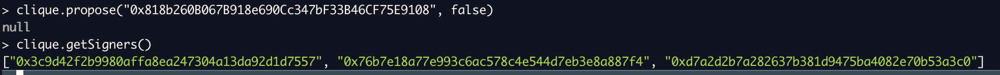

# **Running a Proof of authority network**

## **Lab 3 - Multiple validators**

- I, this lab we're going to run:
  - 1 bootnode
  - 3 full node as validator
  - 1 full node
  - Node accounts are managed by Clef.
  - Promote/Remove validator.

## **Steps**

**1. Clone go-ethereum**

> git clone https://github.com/ethereum/go-ethereum.git

**2. Build geth**

> make all

**3. Create folders for storing chain's data**

> mkdir node1 node2 node3 node4

**4. Create accounts**

- Create account for node 1,2,3,4

  > geth --datadir node1 account new
  >  => 0xD7A2D2b7A282637b381D9475bA4082E70b53a3C0
  >
  > geth --datadir node2 account new
  >  => 0x76b7e18a77e993C6aC578c4e544D7EB3E8A887f4
  >
  > geth --datadir node3 account new
  >  => 0x3C9D42F2b9980aFFA8ea247304A13dA92d1D7557
  >
  > geth --datadir node4 account new
  >  => 0x818b260B067B918e690Cc347bF33B46CF75E9108

**5. Create genesis.json**

- set node 1,2,3 as validator
- set gaslimit 30M
- premined some eth (10^18)

        {
          "config": {
            "chainId": 1234511118889,
            "homesteadBlock": 0,
            "eip150Block": 0,
            "eip155Block": 0,
            "eip158Block": 0,
            "byzantiumBlock": 0,
            "constantinopleBlock": 0,
            "petersburgBlock": 0,
            "istanbulBlock": 0,
            "muirGlacierBlock": 0,
            "berlinBlock": 0,
            "londonBlock": 0,
            "arrowGlacierBlock": 0,
            "grayGlacierBlock": 0,
            "clique": {
              "period": 5,
              "epoch": 30000
            }
          },
          "difficulty": "1",
          "gasLimit": "30000000",
          "extradata": "0x00000000000000000000000000000000000000000000000000000000000000003C9D42F2b9980aFFA8ea247304A13dA92d1D755776b7e18a77e993C6aC578c4e544D7EB3E8A887f4D7A2D2b7A282637b381D9475bA4082E70b53a3C00000000000000000000000000000000000000000000000000000000000000000000000000000000000000000000000000000000000000000000000000000000000",
          "alloc": {
            "eD19d9CE7392A7f2262a67817E0DBAF68dF042b8": {
              "balance": "1000000000000000000000000"
            },
            "146142AFF24195Aea62C84c88017e543c7342911": {
              "balance": "1000000000000000000000000"
            },
            "818b260B067B918e690Cc347bF33B46CF75E9108": {
              "balance": "500000000000000000000"
            }
          }
        }

- **NOTE**:
  - Clique **extradata** field, used to define PoA validators/sealers must match the following format:
    - First part: 32bytes vanity, meaning whatever you want here since it's expressed as an hex string (64 chars long as one byte is 2 chars), here in the example it's just zeros.
    - Second part: concatenated list of sealers/validators nodes addresses. Each address written as hex string without the "0x" prefix and must be 20 bytes long (40 chars long as one byte is 2 chars). The list of signers in checkpoint block extra-data sections **must be sorted in ascending byte order**
    - Third part: a 65 bytes signature suffix called proposer seal. It's used to identify the proposer of the new validator in a block. Given we talk here about the genesis file, this seal has no reason to be because no specific node proposed it, it's the base on which everyone agree before starting. So it must be filled with zeros (65 zeros).

**6. Initializing the Geth Database**

> geth init --datadir node1 genesis.json
>
> geth init --datadir node2 genesis.json
>
> geth init --datadir node3 genesis.json
>
> geth init --datadir node4 genesis.json

**7. Prepping Clef**

- **Init clef for node 1,2,3,4**

  > clef --keystore node1/keystore --configdir node1/clef --chainid 1234511118889 --suppress-bootwarn init
  >
  > clef --keystore node2/keystore --configdir node2/clef --chainid 1234511118889 --suppress-bootwarn init
  >
  > clef --keystore node3/keystore --configdir node3/clef --chainid 1234511118889 --suppress-bootwarn init
  >
  > clef --keystore node4/keystore --configdir node4/clef --chainid 1234511118889 --suppress-bootwarn init

- **Storing passwords in clef for node 1,2,3,4**

  > clef --keystore node1/keystore --configdir node1/clef --chainid 1234511118889 --suppress-bootwarn setpw 0xD7A2D2b7A282637b381D9475bA4082E70b53a3C0
  >
  > clef --keystore node2/keystore --configdir node2/clef --chainid 1234511118889 --suppress-bootwarn setpw 0x76b7e18a77e993C6aC578c4e544D7EB3E8A887f4
  >
  > clef --keystore node3/keystore --configdir node3/clef --chainid 1234511118889 --suppress-bootwarn setpw 0x3C9D42F2b9980aFFA8ea247304A13dA92d1D7557
  >
  > clef --keystore node4/keystore --configdir node4/clef --chainid 1234511118889 --suppress-bootwarn setpw 0x818b260B067B918e690Cc347bF33B46CF75E9108

  - **NOTE**:
    - When clef promt this "Please enter a password to store for this address:" => must input password that used to create account

**7. Using rules to approve blocks**

- Create a file name rules.js:

      function OnSignerStartup(info) {}

      function ApproveListing() {
        return "Approve";
      }

      function ApproveSignData(r) {
        if (r.content_type == "application/x-clique-header") {
          for (var i = 0; i < r.messages.length; i++) {
            var msg = r.messages[i];
            if (msg.name == "Clique header" && msg.type == "clique") {
              return "Approve";
            }
          }
        }
        return "Reject";
      }

- Attest the ruleset:

  > clef --keystore node1/keystore --configdir node1/clef --chainid 1234511118889 --suppress-bootwarn attest \`sha256sum rules.js | cut -f1\`
  >
  > clef --keystore node2/keystore --configdir node2/clef --chainid 1234511118889 --suppress-bootwarn attest \`sha256sum rules.js | cut -f1\`
  >
  > clef --keystore node3/keystore --configdir node3/clef --chainid 1234511118889 --suppress-bootwarn attest \`sha256sum rules.js | cut -f1\`
  >
  > clef --keystore node4/keystore --configdir node4/clef --chainid 1234511118889 --suppress-bootwarn attest \`sha256sum rules.js | cut -f1\`

- If attest successfully, clef can be started, pointing out the rules.js file.
  > clef --keystore node1/keystore --configdir node1/clef --chainid 1234511118889 --suppress-bootwarn --rules rules.js
  >
  > clef --keystore node2/keystore --configdir node2/clef --chainid 1234511118889 --suppress-bootwarn --rules rules.js
  >
  > clef --keystore node3/keystore --configdir node3/clef --chainid 1234511118889 --suppress-bootwarn --rules rules.js
  >
  > clef --keystore node4/keystore --configdir node4/clef --chainid 1234511118889 --suppress-bootwarn --rules rules.js

**9. Running a bootnode**

- Create bootnode key => This key can then be used to generate a bootnode.
  > bootnode -genkey bootnode/boot.key
- Start bootnode, open new terminal:

  > bootnode -nodekey bootnode/boot.key -verbosity 9 -addr :36326
  >
  > => _enode://85301efe374e91e61276ffcdb54dd8e7ec1c86c3179445dcd775b51193c7e908d5265f2f13e80bc9a04e23b927b10d4ca26cf74d6fdd66e0c97333e31e1d39d3@127.0.0.1:0?discport=36321_

**10. Start eth nodes**

geth --datadir node1 --syncmode 'full' --port 30306 --authrpc.port 8551 --networkid 1234511118889 --signer node1/clef/clef.ipc --miner.etherbase 0xD7A2D2b7A282637b381D9475bA4082E70b53a3C0 --mine

geth --datadir node2 --syncmode 'full' --port 30306 --authrpc.port 8551 --networkid 1234511118889 --signer node2/clef/clef.ipc --miner.etherbase 0x76b7e18a77e993C6aC578c4e544D7EB3E8A887f4 --mine

geth --datadir node3 --syncmode 'full' --port 30306 --authrpc.port 8551 --networkid 1234511118889 --signer node3/clef/clef.ipc --miner.etherbase 0x3C9D42F2b9980aFFA8ea247304A13dA92d1D7557 --mine

- Open 2 terminals
- Run node 1 as miner:

  > geth --datadir node1 account new
  >  => 0xD7A2D2b7A282637b381D9475bA4082E70b53a3C0
  >
  > geth --datadir node2 account new
  >  => 0x76b7e18a77e993C6aC578c4e544D7EB3E8A887f4
  >
  > geth --datadir node3 account new
  >  => 0x3C9D42F2b9980aFFA8ea247304A13dA92d1D7557
  >
  > geth --datadir node4 account new
  >  => 0x818b260B067B918e690Cc347bF33B46CF75E9108

  > geth --datadir node1 --syncmode 'full' --port 30306 --authrpc.port 8551 --bootnodes "enode://a4d79a0827a9dc11d135e37005703fb22534d0dea312f787fffae37fdf44378b9be69836f3ab0484235ec87fb289a83de1fb2046c9ad3a73ac26bc900d93815b@127.0.0.1:0?discport=36326" --networkid 1234511118889 --signer node1/clef/clef.ipc --miner.etherbase 0xD7A2D2b7A282637b381D9475bA4082E70b53a3C0 --mine
  >
  > => Node 1 Run, succesfully mined 2nd block (1st block is genesis), but cannot mine 3rd block => (in genesis block, we setup 3 nodes validator, SIGNER_LIMIT = floor(SIGNER_COUNT / 2) + 1) => **SIGNER_LIMIT**: Number of consecutive blocks out of which a signer may only sign one

  

  
  

- Run node 2:

  > geth --datadir node2 --syncmode 'full' --port 30307 --authrpc.port 8552 --bootnodes "enode://a4d79a0827a9dc11d135e37005703fb22534d0dea312f787fffae37fdf44378b9be69836f3ab0484235ec87fb289a83de1fb2046c9ad3a73ac26bc900d93815b@127.0.0.1:0?discport=36326" --networkid 1234511118889 --signer node2/clef/clef.ipc --miner.etherbase 0x76b7e18a77e993C6aC578c4e544D7EB3E8A887f4 --mine
  >
  > => Node 2 Run, succesfully mined 3rd block => Node 1 & Node 2 can now consecutive mine block ( **SIGNER_LIMIT = 2**)

  

  
  

- Run node 3:

  > geth --datadir node3 --syncmode 'full' --port 30308 --authrpc.port 8553 --bootnodes "enode://a4d79a0827a9dc11d135e37005703fb22534d0dea312f787fffae37fdf44378b9be69836f3ab0484235ec87fb289a83de1fb2046c9ad3a73ac26bc900d93815b@127.0.0.1:0?discport=36326" --networkid 1234511118889 --signer node3/clef/clef.ipc --miner.etherbase 0x3C9D42F2b9980aFFA8ea247304A13dA92d1D7557 --mine
  >
  > => Node 3 Run, succesfully sync blocks => Node 1 & Node 2 & Node 3 can now consecutive mine block ( **SIGNER_LIMIT = 2**)

  

  
  

- Stop node 3 for a while, and then restart it with --bootnodes is enode of node 1:
  > geth --datadir node3 --syncmode 'full' --port 30308 --authrpc.port 8553 --bootnodes "enode://22b4e060de13f06f0ba4ebd007fb81208705571f6cb24e793a0f194ffda119825cd29c671ed9afc551a4f4c134d80f1e29fc0f9ab28f9c34e38bcc5d7b3359e0@127.0.0.1:30306" --networkid 1234511118889 --signer node3/clef/clef.ipc --miner.etherbase 0x3C9D42F2b9980aFFA8ea247304A13dA92d1D7557 --mine
  >
  > => Node 3 re-Run, succesfully sync blocks => Node 1 & Node 2 & Node 3 can now consecutive mine block ( **SIGNER_LIMIT = 2**)

**11. Propose new validator**

- Run node 4 with --bootnodes is enode of node 1, run node 4 as a miner, also enable RPC :

  > geth --datadir node4 --syncmode 'full' --port 30309 --authrpc.port 8554 --http --http.addr 'localhost' --http.port 3334 --http.api 'eth,net,web3' --bootnodes "enode://22b4e060de13f06f0ba4ebd007fb81208705571f6cb24e793a0f194ffda119825cd29c671ed9afc551a4f4c134d80f1e29fc0f9ab28f9c34e38bcc5d7b3359e0@127.0.0.1:30306" --networkid 1234511118889 --signer node4/clef/clef.ipc --miner.etherbase 0x818b260B067B918e690Cc347bF33B46CF75E9108 --mine
  >
  > => Node 4 Run, sync blocks => Node 4 try to mine block but get warning _err="unauthorized signer"_ because it's not validator

  

  
  

- To propose a new signer, existing validators can propose it via **clique.propose("0x...", true)**. When more than half the validators proposed it, the authorization comes into effect immediately and the new account can start signing blocks.

- Propose node 4 to validator:

  - On Node1 & Node2:

    > geth attach node1/geth.ipc
    >
    > clique.propose("0x818b260B067B918e690Cc347bF33B46CF75E9108", true)
    >
    > geth attach node2/geth.ipc
    >
    > clique.propose("0x818b260B067B918e690Cc347bF33B46CF75E9108", true)
    >
    > **=> Wait for a few minutes and you can observe that now even Node4 has started signing blocks.**

  - Verify:

    > geth attach node1/geth.ipc
    >
    > clique.getSigners()

    

    
    

**12. Remove a validator**

- Existing validators can remove an existing validator via **clique.propose("0x...", false)**. If half + 1 signers deauthorize a signer, it is immediately removed from the list and blocks minted by it are rejected from that point onward

- Propose node 4 to validator:

  - On Node1 & Node2:

    > geth attach node1/geth.ipc
    >
    > clique.propose("0x818b260B067B918e690Cc347bF33B46CF75E9108", false)
    >
    > geth attach node2/geth.ipc
    >
    > clique.propose("0x818b260B067B918e690Cc347bF33B46CF75E9108", true)
    >
    > geth attach node3/geth.ipc
    >
    > clique.propose("0x818b260B067B918e690Cc347bF33B46CF75E9108", true)
    >
    > **=> Wait for a few minutes and you can observe that now even Node4 cannot sign block any more.**

    

    
    

**13. Testing Through JSON-RPC IPC**

- IPC (Inter-Process Communication) works only locally : you should be on the same machine as your node.

- Connect to node 4
  > geth attach node4/geth.ipc
- The file geth.ipc is created only when the node is running. So do not expect to find it if your node4 is off

- IPC gives access without restriction to all modules listed in the terminal : admin:1.0 clique:1.0 debug:1.0 engine:1.0 eth:1.0 miner:1.0 net:1.0 rpc:1.0 txpool:1.0 web3:1.0

  > net.peerCount
  >
  > admin.peers
  >
  > eth.getBalance(eth.accounts[0])
  >
  > eth.blockNumber
  >
  > web3.fromWei(eth.getBalance(eth.accounts[0]), 'ether');
  >
  > web3.fromWei(eth.getBalance('0x146142AFF24195Aea62C84c88017e543c7342911'), 'ether');
  >
  > eth.sendTransaction({
  > to: '0x146142AFF24195Aea62C84c88017e543c7342911',
  > from: eth.accounts[0],
  > value: web3.toWei(100, 'ether')
  > });

**13. Testing Through JSON-RPC HTTP**

- RPC (Remote Procedure Call) works over the internet as HTTP requests.
- Therefore be careful when you open RPC to the outside world as everyone will have access to your node.
- For this reason RPC is disabled by default and when enabled it does not give access to all modules.
- In this guide we allowed RPC on our Geth node with the command --http and gave access to the modules eth,net,web3.

  > --http --http.addr 'localhost' --http.port 3334 --http.api 'eth,net,web3'

- To connect to node1 using RPC :

  > geth attach 'http://localhost:3334
  >
  > net.peerCount
  >
  > eth.getBalance(eth.accounts[0])
  >
  > eth.blockNumber
