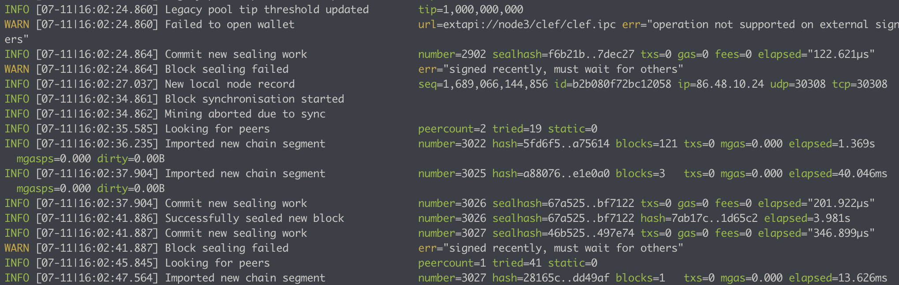

# **Running a Proof of authority network**

## **Lab 4 - Blockchain Import/Export**

- I, this lab we're going to run:
  - 1 bootnode
  - 3 full node as validator
  - 1 full node
  - Node accounts are managed by Clef.
  - We're going to do a backup and restore on full node.

## **Steps**

**1. Set up environment and run nodes as described in [Lab 3](./3-lab3.md)**

**2. Blockchain Import/Export**

- Backup node4's blockchain in binary format:

  > geth --datadir node4 export node4bu

  

  
  

- Remove node4's blockchain data:

  > rm -rf node4/geth

- Re-Initializing the Geth Database for node4:

  > geth init --datadir node4 genesis.json

- Restore node4's blockchain data:

  > geth --datadir node4 import node4bu

  

  
  

- Start node4:

  > geth --datadir node4 --syncmode 'full' --port 30309 --authrpc.port 8554 --bootnodes "enode://22b4e060de13f06f0ba4ebd007fb81208705571f6cb24e793a0f194ffda119825cd29c671ed9afc551a4f4c134d80f1e29fc0f9ab28f9c34e38bcc5d7b3359e0@127.0.0.1:30306" --networkid 1234511118889 --signer node4/clef/clef.ipc
  >
  > => Node 4 re-Run, succesfully sync blocks

  

  
  

**3. Back up/Restore the same bu file for another node**

- Remove node3's blockchain data (node 3 is a validator):

  > rm -rf node3/geth

- Re-Initializing the Geth Database for node3:

  > geth init --datadir node3 genesis.json

- Restore node3's blockchain data:

  > geth --datadir node3 import node4bu

  

  
  

- Start node3:

  > geth --datadir node3 --syncmode 'full' --port 30308 --authrpc.port 8553 --bootnodes "enode://22b4e060de13f06f0ba4ebd007fb81208705571f6cb24e793a0f194ffda119825cd29c671ed9afc551a4f4c134d80f1e29fc0f9ab28f9c34e38bcc5d7b3359e0@127.0.0.1:30306" --networkid 1234511118889 --signer node3/clef/clef.ipc --miner.etherbase 0x3C9D42F2b9980aFFA8ea247304A13dA92d1D7557 --mine
  >
  > => Node 3 re-Run, succesfully sync blocks => Node 1 & Node 2 & Node 3 can now consecutive mine block ( **SIGNER_LIMIT = 2**)

  

  
  

